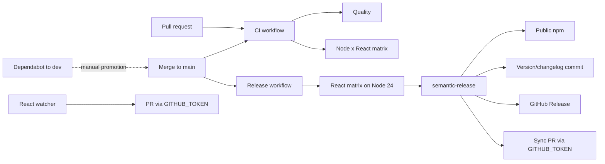
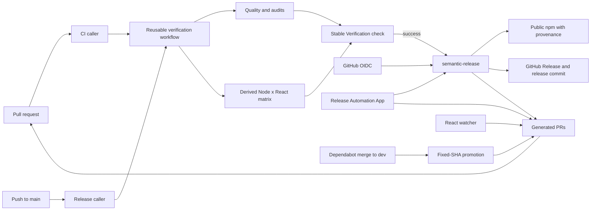

# Flow Stack CI Modernization Architecture and Implementation Plan

> Status: AWAITING ACCEPTANCE
>
> Plan version: 5.1
>
> Revision: 16
>
> Last updated: 2026-09-02
>
> Repository/workspace: `flow-stack` in the `Self` workspace root
>
> Branch: `ci/update`
>
> Baseline commit: `525e8d7817b205d39b33f37b938655a1a8cad775`
>
> Working tree: Clean at planning baseline
>
> Canonical location: `docs/development/flow-stack-ci-modernization-plan.md`
>
> Current phase: Phase 3
>
> Implementation authorization: Phase 3 granted on 2026-09-02 (`Phase 2 accepted. Proceed with phase 3`)
>
> Supersedes: None

## Purpose

This plan governs modernization of Flow Stack's GitHub CI, dependency automation, React compatibility automation, and public npm release workflow. It adapts applicable controls from the Synaptech `npm-packages` repository while preserving Flow Stack's single-package semantic-release model, public npm publishing target, and Node/React compatibility promises.

The durable outcome is a release path in which the exact commit published to npm passes one authoritative verification workflow, automated pull requests trigger normal protections, repository mutations use short-lived least-privilege credentials, and manual GitHub/npm configuration is documented and testable.

> This is a planning document. It does not authorize implementation.

## Intent and Goals

### Intent

Make Flow Stack's automation reliable, secure, understandable, and maintainable without importing monorepo- or AWS-specific machinery from `npm-packages`.

### Goals

1. Make one reusable workflow authoritative for pull-request and pre-publish verification.
2. Test every supported Node and React major before publication.
3. Remove duplicated React compatibility lists and repair React-major automation.
4. Use least-privilege, short-lived credentials for npm publishing and repository mutation.
5. Consolidate Dependabot into exactly one open grouped npm version-update PR and one open grouped GitHub Actions version-update PR, both reviewable and promotable from `dev` to `main`.
6. Keep `package.json` authoritative for the package contract without repository-specific validation wrappers.
7. Establish branch rulesets, a GitHub App, a protected release environment, and npm Trusted Publishing through explicit manual steps.
8. Keep release and recovery procedures in repository documentation.

### Success Outcomes

- A required `Verification` check represents all quality and compatibility jobs and cannot pass when any dependency job fails or is cancelled.
- The release job cannot publish until `Verification` succeeds for the release commit.
- React support is declared once in `package.json`; automation and matrices derive from it.
- Generated React, dependency-promotion, and back-merge pull requests trigger normal PR checks.
- Dependabot does not fan out routine updates by dependency: all eligible npm updates share one PR and all eligible GitHub Actions updates share one PR.
- No long-lived npm token is stored; npm publishing uses GitHub OIDC Trusted Publishing.
- semantic-release receives a GitHub App token only in its mutation step and checkout never persists credentials.
- `main` and `dev` are protected by stable required checks and restricted update rules.

## Scope

### In Scope

- `.github/workflows/ci.yml`
- `.github/workflows/release.yml`
- `.github/workflows/pr-title.yml`
- `.github/workflows/react-major-support.yml`
- A reusable verification workflow under `.github/workflows/`
- A dependency-promotion workflow under `.github/workflows/`
- `.github/dependabot.yml`
- `.github/scripts/update-react-major-support.ts` and focused tests
- `package.json`, `pnpm-lock.yaml`, `pnpm-workspace.yaml`, and `release.config.mjs`
- Release, automation, and contributor documentation
- Manual GitHub ruleset, environment, GitHub App, and npm Trusted Publisher configuration

### Out of Scope

- Lerna, Nx, workspace package generation, fixed-version monorepo releases, or recursive publishing
- AWS OIDC, CodeArtifact, IAM roles, or private registry configuration
- Product source behavior or public Flow Stack APIs
- React support for a new major; this initiative only makes future evaluation reliable
- Changing the Node or React support policy currently declared by the package
- Automated dependency merging
- Renovate or another replacement for Dependabot
- Replacing semantic-release
- Unrelated dependency upgrades or repository cleanup

### Deferred Possibilities

- Removing committed `package.json` version and `CHANGELOG.md` updates from semantic-release. The current behavior is preserved because changing release artifacts is a separate product/repository policy decision.
- Separate GitHub Apps for release mutation and PR automation. One shared account-level App with repository-selected installations is used initially; split it if organizational policy requires tighter actor separation.
- Enforcing signed commits. This depends on contributor and bot signing policy outside this initiative.

## Non-Negotiable Execution Protocol

1. Implementation proceeds through strictly sequential phases.
2. Only one phase may be active at a time.
3. Starting Phase 1 requires explicit user authorization.
4. Completing a phase does not authorize the next phase.
5. After each phase, implementation stops and presents changed files, public API changes, tests, commands, evidence, deviations, and unresolved issues.
6. The next phase begins only after explicit user acceptance of the prior phase and authorization of the next.
7. Work outside the active phase allowlist is prohibited unless this plan is revised and the deviation is approved.
8. Unexpected unrelated defects are documented, not repaired.
9. The implementing agent must reread this entire document before planning the next phase, before starting each phase, and after context compaction, handoff, or resumed work.
10. This plan is updated at every phase boundary with authorization, backlog status, validation evidence, deviations, and acceptance.
11. Only tasks present in the authorized phase backlog may be executed. Newly discovered tasks require a documented plan revision before execution.
12. An implementation, design, behavior, or intent change outside approved scope must not be executed or silently incorporated. Stop, document the proposal, ask the user for direction, and wait.
13. This plan remains the canonical initiative source of truth until explicitly superseded, promoted, archived, or removed.
14. Ambiguous approval language does not authorize crossing a phase boundary.

Unambiguous authorization examples:

- `Authorize Phase 1.`
- `Phase 1 is accepted. Authorize Phase 2.`

## Document Maintenance Protocol

- Increment `Revision` for every saved plan update, implementation checkpoint, and phase closeout.
- Increment the minor plan version for additive clarification that preserves scope and architecture.
- Increment the major plan version when approved scope, target architecture, canonical semantics, or phase structure changes materially.
- Preserve requirement and task IDs. Mark removed entries `SUPERSEDED`, `OUT OF SCOPE`, or `REMOVED`; never silently delete history.
- Update the revision log, phase table, affected requirements, decisions, tasks, evidence, and acceptance state together.
- Use only the defined document statuses: `DRAFT`, `BLOCKED`, `READY FOR REVIEW`, `APPROVED`, `IN PROGRESS`, `AWAITING ACCEPTANCE`, `COMPLETE`, and `SUPERSEDED`.

## Planning Baseline

| Field                          | Value                                                                                   | Evidence                                                                          |
| ------------------------------ | --------------------------------------------------------------------------------------- | --------------------------------------------------------------------------------- |
| Repository root                | `C:\Users\clale\Projects\Work\Self\flow-stack`                                          | Workspace inspection                                                              |
| Branch                         | `ci/update`                                                                             | `git branch --show-current`                                                       |
| Baseline commit                | `525e8d7817b205d39b33f37b938655a1a8cad775`                                              | `git rev-parse HEAD`                                                              |
| Working tree                   | Clean                                                                                   | `git status --short` returned no entries                                          |
| Relevant components            | GitHub workflows, Dependabot, semantic-release, package metadata, release documentation | `.github/`, `package.json`, `release.config.mjs`, `CONTRIBUTING.md`               |
| Existing Flow Stack plans/docs | No `/docs` tree existed at baseline                                                     | Workspace file search                                                             |
| Comparison source              | Synaptech `npm-packages` automation and `docs/development/release.md`                   | Repository inspection                                                             |
| Recent automation history      | Action upgrades and dependency update commits are active on the branch                  | `git log -5 --oneline -- .github package.json release.config.mjs CONTRIBUTING.md` |
| Toolchain                      | Node 20.19+; pnpm 10; CI uses Node 20, 22, and 24                                       | `package.json`, `.github/workflows/ci.yml`                                        |

An ignored `package-lock.json` exists locally but is not authoritative. `pnpm-lock.yaml` remains the only lockfile in scope.

## Revision Log

| Revision | Plan Version | Date       | Status              | Summary                                                                                                                                                                                                         | Author/Source                             |
| -------- | ------------ | ---------- | ------------------- | --------------------------------------------------------------------------------------------------------------------------------------------------------------------------------------------------------------- | ----------------------------------------- |
| 1        | 1.0          | 2026-09-02 | READY FOR REVIEW    | Initial architecture and phased implementation plan.                                                                                                                                                            | Initiative Architect                      |
| 2        | 2.0          | 2026-09-02 | READY FOR REVIEW    | Replaced production/development npm PR groups with one catch-all npm group, added one catch-all GitHub Actions group, limited each ecosystem to one open PR, and aligned promotion/release semantics.           | User direction                            |
| 3        | 2.0          | 2026-09-02 | IN PROGRESS         | Recorded Phase 1 authorization and added `vitest.config.ts` to its allowlist so the planned `test/tooling` suite runs in the Node test project.                                                                 | Phase 1 implementation                    |
| 4        | 3.0          | 2026-09-02 | IN PROGRESS         | Replaced immutable action SHA pinning with maintained major-version tags such as `@v7`, accepting tag mutability and relying on grouped Dependabot review for updates.                                          | User direction                            |
| 5        | 3.0          | 2026-09-02 | IN PROGRESS         | Broadened Node test discovery to all `.test.ts` files outside jsdom/type-owned trees and allowed a colocated `.d.mts` boundary for importable React support tooling.                                            | User direction and Phase 1 implementation |
| 6        | 3.0          | 2026-09-02 | IN PROGRESS         | Replaced the React support `.mjs` implementation and declaration pair with directly executable TypeScript GitHub scripts under the existing Node 24 runtime policy.                                             | User direction                            |
| 7        | 3.0          | 2026-09-02 | IN PROGRESS         | Recorded authorization to add direct `@types/node` development declarations required to typecheck the TypeScript GitHub CLI without local hand-written Node API declarations.                                   | User authorization                        |
| 8        | 3.0          | 2026-09-02 | AWAITING ACCEPTANCE | Completed the Phase 1 backlog and recorded focused, repository-wide, runtime, diagnostic, formatting, and diff validation evidence; hosted GitHub job-graph confirmation remains a PR acceptance check.         | Phase 1 closeout                          |
| 9        | 3.0          | 2026-09-02 | IN PROGRESS         | Recorded explicit Phase 1 acceptance and Phase 2 authorization; activated package and supply-chain validation tasks P2-T001 through P2-T004.                                                                    | User authorization                        |
| 10       | 4.0          | 2026-09-02 | IN PROGRESS         | Removed the monorepo-derived hard-coded package metadata and file-list validator; `package.json` remains authoritative, established analyzers interpret it, and the local script tests only packed consumers.   | User direction                            |
| 11       | 5.0          | 2026-09-02 | IN PROGRESS         | Removed package validation entirely, including its script, package commands, analyzers, packed-consumer requirements, and workflow plan; Phase 2 now covers only distinct audits and action-tag normalization.  | User direction                            |
| 12       | 5.0          | 2026-09-02 | IN PROGRESS         | Authorized patched transitive overrides for `nanoid@3.3.18` and `browserslist@4.28.8` after the new fail-closed vulnerability audit identified three high-severity advisories.                                  | User authorization                        |
| 13       | 5.0          | 2026-09-02 | AWAITING ACCEPTANCE | Completed active Phase 2 audit and action-normalization tasks, remediated three high-severity transitive advisories, and recorded local validation plus the remaining GitHub-hosted workflow evidence.          | Phase 2 closeout                          |
| 14       | 5.1          | 2026-09-02 | IN PROGRESS         | Recorded Phase 2 acceptance, Phase 3 authorization, completed M-001 through M-003 prerequisites, the shared App's repository-selected installation model, and completion of unprivileged PR-title task P3-T005. | User confirmation and Phase 3 start       |
| 15       | 5.1          | 2026-09-02 | IN PROGRESS         | Completed the Phase 3 implementation backlog: isolated OIDC publication, ephemeral App-authenticated mutations, credential-free release analysis, checked sync/React PRs, and unprivileged title validation.    | Phase 3 implementation checkpoint         |
| 16       | 5.1          | 2026-09-02 | AWAITING ACCEPTANCE | Closed Phase 3 implementation with full local validation, security/correctness review repairs, confirmed App/environment/Trusted Publisher prerequisites, and explicit hosted acceptance checks.                | Phase 3 closeout                          |

## Phase Status

| Phase | Conceptual Boundary                                                | Status              | Backlog Progress                 | Authorization       | Acceptance          | Revision |
| ----- | ------------------------------------------------------------------ | ------------------- | -------------------------------- | ------------------- | ------------------- | -------- |
| 1     | Canonical verification and React compatibility                     | COMPLETE            | 5 / 5 complete                   | Received 2026-09-02 | Received 2026-09-02 | 9        |
| 2     | Supply-chain validation and action normalization                   | COMPLETE            | 2 / 2 active complete; 2 removed | Received 2026-09-02 | Received 2026-09-02 | 14       |
| 3     | Credentialed release and generated-PR automation                   | AWAITING ACCEPTANCE | 5 / 5 complete                   | Received 2026-09-02 | Not received        | 16       |
| 4     | Dependabot grouping, promotion, and policy                         | NOT STARTED         | 0 / 4 complete                   | Not received        | Not received        | 2        |
| 5     | Branch enforcement, operations documentation, and end-to-end proof | NOT STARTED         | 0 / 4 complete                   | Not received        | Not received        | 2        |

## Requirement Sources

| Source ID | Source                                        | Authority/Scope     | Relevant Material                                                                         |
| --------- | --------------------------------------------- | ------------------- | ----------------------------------------------------------------------------------------- |
| SRC-000   | Initiative execution protocol                 | Initiative process  | Phase gates, backlog control, scope control, handoff, and reread requirements             |
| SRC-001   | User request                                  | Initiative          | Durable Flow Stack CI plan including manual branch protection and GitHub App setup        |
| SRC-002   | Repository development and architecture rules | Repository          | Maintainability, existing patterns, explicit boundaries, focused changes, full validation |
| SRC-003   | Repository security and CI rules              | Workflows/scripts   | Least privilege, OIDC, secret handling, trust-boundary validation                         |
| SRC-004   | Environment safety constraints                | Local environment   | No installs, machine changes, services, or destructive actions without permission         |
| SRC-005   | Current Flow Stack automation                 | Current behavior    | CI, release, React support, Dependabot, PR title checks, semantic-release                 |
| SRC-006   | Synaptech `npm-packages` automation           | Comparison evidence | GitHub App tokens, dependency promotion, cooldowns, package checks, release docs          |
| SRC-007   | Flow Stack package and contributor contracts  | Current behavior    | Supported engines/peers, scripts, branching model, release classification                 |

## Active Requirements

### Functional Requirements

| ID     | Requirement                                                                                                                                                                                   | Source           | Verification                                             | Status |
| ------ | --------------------------------------------------------------------------------------------------------------------------------------------------------------------------------------------- | ---------------- | -------------------------------------------------------- | ------ |
| FR-001 | Pull requests to `main`, `dev`, `release/**`, and `hotfix/**` must run one authoritative verification contract.                                                                               | SRC-001, SRC-005 | Trigger tests and GitHub check results                   | ACTIVE |
| FR-002 | A release must not start mutation or publication until the release commit passes all supported Node and React combinations.                                                                   | SRC-001, SRC-005 | Release dependency graph and controlled release evidence | ACTIVE |
| FR-003 | React-major automation must update `package.json` and compatibility documentation, open a PR to `dev`, and rely on derived matrices rather than editing workflow YAML.                        | SRC-005          | Script tests and automation PR evidence                  | ACTIVE |
| FR-004 | Dependabot scheduled version updates must produce at most one open catch-all npm PR and at most one open catch-all GitHub Actions PR against `dev`, rather than one PR per dependency/action. | SRC-001          | Dependabot configuration and observed PRs                | ACTIVE |
| FR-005 | Post-release synchronization from `main` to `dev` must create at most one open PR and trigger normal checks.                                                                                  | SRC-005, SRC-006 | Controlled release evidence                              | ACTIVE |
| FR-006 | PR titles must be conventional for non-draft PRs, including generated automation PRs.                                                                                                         | SRC-005, SRC-007 | PR-title workflow checks                                 | ACTIVE |
| FR-007 | Merging either grouped Dependabot PR into `dev` must create one reviewable draft snapshot PR to `main` at the exact merge commit.                                                             | SRC-001, SRC-006 | Event-filter tests and controlled PR evidence            | ACTIVE |

### Domain and Data Requirements

| ID     | Requirement                                                                                                                                                                                                   | Source           | Verification                                      | Status |
| ------ | ------------------------------------------------------------------------------------------------------------------------------------------------------------------------------------------------------------- | ---------------- | ------------------------------------------------- | ------ |
| DR-001 | `package.json.peerDependencies.react` is the canonical source for supported React majors; `react-dom` must have the same range.                                                                               | SRC-005, SRC-007 | Matrix preparation and validator tests            | ACTIVE |
| DR-002 | The supported Node matrix remains 20, 22, and 24 while `engines.node` is `>=20.19.0`; changing support requires a plan revision.                                                                              | SRC-005, SRC-007 | Workflow matrix inspection and jobs               | ACTIVE |
| DR-003 | Dependency-promotion branches identify the source Dependabot PR and point exactly to its merge commit.                                                                                                        | SRC-006          | GitHub API assertions and workflow evidence       | ACTIVE |
| DR-004 | `pnpm-lock.yaml` is authoritative; compatibility jobs may mutate manifests only in ephemeral runners and must not upload or commit those mutations.                                                           | SRC-004, SRC-005 | Git diff guard in workflow and repository status  | ACTIVE |
| DR-005 | The npm group uses the conventional `chore(deps)` release classification even when it includes development dependencies; the GitHub Actions group uses `ci(deps)` and does not itself request an npm release. | SRC-001, SRC-005 | Dependabot PR titles and semantic-release dry run | ACTIVE |

### Architectural Requirements

| ID     | Requirement                                                                                                                                                                             | Source           | Verification                                 | Status |
| ------ | --------------------------------------------------------------------------------------------------------------------------------------------------------------------------------------- | ---------------- | -------------------------------------------- | ------ |
| AR-001 | A reusable workflow owns quality and compatibility verification; CI and release call it instead of duplicating steps.                                                                   | SRC-001, SRC-002 | Workflow graph review                        | ACTIVE |
| AR-002 | A final `Verification` job uses `if: always()` and fails unless every required upstream job succeeded. Branch rules depend on this stable check rather than dynamic matrix check names. | SRC-001, SRC-005 | Failure/cancellation workflow tests          | ACTIVE |
| AR-003 | semantic-release remains the release engine and public npm remains the publication target.                                                                                              | SRC-005, SRC-007 | Release config and controlled dry run        | ACTIVE |
| AR-004 | Existing committed `package.json` version and `CHANGELOG.md` release artifacts remain enabled.                                                                                          | SRC-005          | semantic-release dry run and release commit  | ACTIVE |
| AR-005 | Workflow automation must use structured JSON parsing and pure functions for package metadata; it must not rewrite YAML matrices using regex.                                            | SRC-002, SRC-005 | Script unit tests and code review            | ACTIVE |
| AR-006 | GitHub Actions dependencies must use maintained major-version tags such as `@v7`; Dependabot continues to update them through the single grouped GitHub Actions PR.                     | SRC-001          | Workflow source inspection and Dependabot PR | ACTIVE |

### Security and Operational Requirements

| ID     | Requirement                                                                                                                                                                                      | Source                    | Verification                                           | Status |
| ------ | ------------------------------------------------------------------------------------------------------------------------------------------------------------------------------------------------ | ------------------------- | ------------------------------------------------------ | ------ |
| SR-001 | Checkout must set `persist-credentials: false` in every job.                                                                                                                                     | SRC-003, SRC-006          | Workflow source inspection                             | ACTIVE |
| SR-002 | Public npm publishing must use GitHub OIDC Trusted Publishing through a protected `npm` environment; no long-lived npm token may be added.                                                       | SRC-001, SRC-003          | GitHub/npm settings and publication attestation        | ACTIVE |
| SR-003 | Repository mutation and generated PRs must use a repository-installed GitHub App token with only Contents, Issues, and Pull requests permissions required by semantic-release and PR automation. | SRC-001, SRC-003, SRC-006 | App settings, workflow permissions, and audit log      | ACTIVE |
| SR-004 | App authentication must be injected only into mutation steps and must not be persisted in checkout or written to repository files/logs.                                                          | SRC-003, SRC-006          | Workflow inspection and masked log review              | ACTIVE |
| SR-005 | `pull_request_target` workflows must never check out or execute PR-controlled code. PR-title validation will use `pull_request` because write privileges are unnecessary.                        | SRC-003, SRC-005          | Trigger and permission inspection                      | ACTIVE |
| SR-006 | Vulnerability auditing and registry signature verification are separate fail-closed controls with accurate step names.                                                                           | SRC-003, SRC-006          | CI logs for `pnpm audit` and `npm audit signatures`    | ACTIVE |
| SR-007 | Automated branch creation/deletion must validate branch name and exact expected SHA and refuse unexpected existing state.                                                                        | SRC-003, SRC-006          | Workflow tests and controlled run                      | ACTIVE |
| SR-008 | `main` and `dev` rulesets must block force pushes/deletion and require PRs plus stable CI checks; only the Release Automation App may bypass `main` for semantic-release commits.                | SRC-001, SRC-003          | GitHub ruleset export/screenshots and controlled tests | ACTIVE |
| OR-001 | Release and generated-PR jobs must use concurrency groups that prevent duplicate mutation without cancelling an active release.                                                                  | SRC-005                   | Concurrent dispatch test or workflow graph             | ACTIVE |
| OR-002 | Failure recovery must never delete published npm versions as a normal rollback; use a corrective patch or npm deprecation.                                                                       | SRC-006                   | Release runbook review                                 | ACTIVE |
| OR-003 | Workflow logs must identify the source SHA/PR and outcome without printing credentials or authentication headers.                                                                                | SRC-003                   | Log review                                             | ACTIVE |

### Testing and Validation Requirements

| ID     | Requirement                                                                                                                                                                             | Source           | Verification                    | Status  |
| ------ | --------------------------------------------------------------------------------------------------------------------------------------------------------------------------------------- | ---------------- | ------------------------------- | ------- |
| TR-001 | React support parsing and update generation must have Vitest coverage for no-op, next-major, malformed range, mismatched React DOM, README replacement, and write-failure cases.        | SRC-002, SRC-005 | Focused Vitest suite            | ACTIVE  |
| TR-002 | Verification must run format check, lint, typecheck, build, tests, vulnerability audit, and signature audit.                                                                            | SRC-002, SRC-006 | Reusable workflow logs          | ACTIVE  |
| TR-003 | Packed-artifact consumer validation was removed because this single-package repository treats `package.json` as authoritative and does not need the copied monorepo validation pattern. | User direction   | Revision 11                     | REMOVED |
| TR-004 | Workflow event filters, result aggregation, branch collision handling, and dry-run paths require reviewable tests or controlled GitHub runs before enforcement.                         | SRC-001, SRC-003 | Test records and phase evidence | ACTIVE  |
| TR-005 | Validation uses the repository's active Node/pnpm toolchain and does not install dependencies or alter the machine without explicit permission.                                         | SRC-004          | Command record                  | ACTIVE  |

### Process and Handoff Requirements

| ID     | Requirement                                                                                                                                                                                 | Source                    | Verification                              | Status |
| ------ | ------------------------------------------------------------------------------------------------------------------------------------------------------------------------------------------- | ------------------------- | ----------------------------------------- | ------ |
| PR-001 | Implementation is limited to the authorized phase backlog and approved scope. Out-of-scope design or intent changes require consultation and explicit direction.                            | SRC-000                   | Phase backlog, revision history, closeout | ACTIVE |
| PR-002 | The canonical plan must be reread in full before planning or starting each phase and after compaction, handoff, or resumed work.                                                            | SRC-000                   | Phase checkpoint and closeout             | ACTIVE |
| PR-003 | Manual repository or account configuration occurs only at the documented gate and requires the user; credentials are never supplied through chat.                                           | SRC-001, SRC-003, SRC-004 | Gate evidence without secret values       | ACTIVE |
| PR-004 | No dependency installation, environment alteration, service/container operation, release, branch mutation, or remote settings change occurs without explicit authorization for that action. | SRC-004                   | Command and phase authorization record    | ACTIVE |

## Acceptance Criteria

| ID     | Acceptance Criterion                                                                                                                                                                    | Requirements                   | Evidence                                        |
| ------ | --------------------------------------------------------------------------------------------------------------------------------------------------------------------------------------- | ------------------------------ | ----------------------------------------------- |
| AC-001 | A deliberately failing matrix cell makes the stable `Verification` check fail, blocks merge, and prevents the release job.                                                              | FR-001, FR-002, AR-001, AR-002 | Controlled PR/run                               |
| AC-002 | A React peer range fixture produces the expected dynamic matrix; the next-major updater changes only package metadata/docs and opens a checked PR.                                      | FR-003, DR-001, AR-005, TR-001 | Tests and controlled dispatch                   |
| AC-003 | A release from `main` publishes only after verification, produces a GitHub release and committed changelog/version, and has npm provenance.                                             | FR-002, AR-003, AR-004, SR-002 | Release logs, npm/GitHub artifacts              |
| AC-004 | App-created React, dependency-promotion, and sync PRs all run `Verification` and PR-title checks.                                                                                       | FR-003, FR-004, FR-005, SR-003 | GitHub checks on controlled PRs                 |
| AC-005 | Dependabot exposes no more than one open scheduled npm update PR and one open scheduled GitHub Actions update PR; merging either creates one draft promotion PR at the exact merge SHA. | FR-004, FR-007, DR-003, SR-007 | Dependabot PR list and controlled workflow runs |
| AC-006 | Repository checkout/config/log review finds no persisted or exposed App/npm credentials.                                                                                                | SR-001, SR-002, SR-004         | Workflow and log review                         |
| AC-007 | Branch rules block direct human pushes, force pushes, deletion, and merging without required checks while allowing the App's release commit.                                            | SR-008                         | Controlled ruleset tests                        |
| AC-008 | Removed: packed package validation is not part of this single-package repository's CI contract.                                                                                         | None                           | User direction, revision 11                     |

## Assumptions and Constraints

### Assumptions

| ID      | Assumption                                                                                                                    | Basis                                                 | Risk if False                                                             | Resolution                                                                                       |
| ------- | ----------------------------------------------------------------------------------------------------------------------------- | ----------------------------------------------------- | ------------------------------------------------------------------------- | ------------------------------------------------------------------------------------------------ |
| ASM-001 | The repository uses squash merging so the PR title becomes the release-visible commit subject.                                | Existing PR-title workflow and semantic-release model | Releases may be missed or misclassified                                   | Confirm in Phase 5 manual settings; otherwise revise plan to add commit-message enforcement      |
| ASM-002 | npm Trusted Publishing is available for `clalexander/flow-stack` and the public package.                                      | Existing `id-token: write` release design             | Publication cannot authenticate without a token                           | Verify before Phase 3; mark Phase 3 blocked if unavailable rather than adding a long-lived token |
| ASM-003 | The user can create/install a GitHub App and configure repository rulesets/environments.                                      | User request                                          | Generated PR checks and protected release commits cannot work as designed | Complete manual gate before Phase 3                                                              |
| ASM-004 | GitHub Actions Ubuntu runners provide npm compatible with `npm audit signatures` for the pnpm lockfile.                       | `npm-packages` pattern                                | Signature check may not understand the lockfile                           | Prove in Phase 2; stop for plan revision if unsupported                                          |
| ASM-005 | One shared Release Automation App with repository-selected installations is acceptable for release commits and generated PRs. | User direction and `npm-packages` precedent           | Permission surface may exceed policy                                      | Split into repository-specific or purpose-specific Apps through a plan revision if required      |

### Constraints

- The local toolchain and machine configuration must remain unchanged unless separately authorized.
- Workflow changes cannot prove external GitHub/npm settings locally.
- Major-version action tags are mutable upstream references. This accepted risk is mitigated by limiting actions to established publishers, least-privilege workflow permissions, and reviewing the single grouped GitHub Actions Dependabot PR.
- Branch rules cannot require newly named checks until those checks have run at least once in the repository.
- App private keys and npm/GitHub credentials must be entered directly in trusted product interfaces, never in chat or repository files.

## Material Open Questions

None. The assumptions above have explicit stop conditions. Plan approval accepts preserving committed release artifacts, using one repository-scoped Release Automation App, and using an approval-protected `npm` environment.

## Terminology

- **Verification workflow**: reusable workflow containing all quality, package, and compatibility jobs.
- **Verification check**: stable aggregate job required by branch rules.
- **Release commit**: exact `main` commit evaluated before semantic-release mutation/publication.
- **Release Automation App**: GitHub App used for semantic-release Git/GitHub operations and generated pull requests.
- **npm update group**: the single Dependabot PR containing all eligible npm ecosystem version updates, including production and development dependencies, using `chore(deps)`.
- **GitHub Actions update group**: the single Dependabot PR containing all eligible action version updates, using `ci(deps)`.
- **Eligible update**: a version update not suppressed by an explicit compatibility ignore or cooldown. React major updates are intentionally ineligible because the React compatibility watcher owns them.
- **Promotion PR**: draft PR from a fixed `release/dependencies-<PR number>` branch into `main`.
- **Trusted Publishing**: npm publication using GitHub Actions OIDC instead of a stored npm token.

## Current-State Observations

1. CI has a quality job and a Node 20/22/24 by React 18/19 matrix, but release independently repeats a React-only Node 24 matrix. Evidence: `.github/workflows/ci.yml`, `.github/workflows/release.yml`.
2. CI and release compatibility steps run `pnpm add -D --save-exact` at a pnpm workspace root without an explicit workspace-root flag. Evidence: both workflow files and `pnpm-workspace.yaml`.
3. The baseline React updater searches for inline YAML arrays while the workflows use block arrays, so a new React major reaches an exception after local runner mutations. Evidence: baseline `.github/scripts/update-react-major-support.mjs` and both matrices.
4. The updater's README pattern says `React and react-dom`; README says `React and React DOM`. Evidence: updater and `README.md`.
5. semantic-release publishes one public npm package, writes `package.json` and `CHANGELOG.md`, creates GitHub release artifacts, and only releases `chore(deps)`, not `chore(deps-dev)`. Evidence: `release.config.mjs`.
6. Generated React and sync PRs use `GITHUB_TOKEN`; such generated events do not reliably trigger normal downstream workflows. Evidence: React and release workflows.
7. Release checkout persists credentials while running dependencies and release plugins. Evidence: release checkout lacks `persist-credentials: false`.
8. Steps named “Verify dependency signatures” execute `pnpm audit`, which is a vulnerability advisory audit rather than signature verification. Evidence: CI/release workflows.
9. Dependabot targets `dev`, currently splits npm production and development minor/patch updates and does not group GitHub Actions updates; therefore it can open multiple routine PRs. It excludes React majors and has no cooldown or promotion path. Evidence: `.github/dependabot.yml`.
10. PR-title validation uses `pull_request_target` with read-only permissions and no checkout; it is currently constrained but does not require the target trigger.
11. `pnpm-workspace.yaml` has `minimumReleaseAgeExclude` without `minimumReleaseAge`, so the exception has no active age policy.
12. `CONTRIBUTING.md` recommends human-readable non-conventional commits and manual version/changelog work, conflicting with semantic-release behavior.

### Documentation or Contract Discrepancies

| ID       | Documentation Says                                         | Code/Tests Say                                                  | Planned Resolution                                              |
| -------- | ---------------------------------------------------------- | --------------------------------------------------------------- | --------------------------------------------------------------- |
| DISC-001 | Release branches prepare versions and changelogs manually. | semantic-release writes both after merge to `main`.             | Document semantic-release as authoritative in Phase 5.          |
| DISC-002 | Example commits are not conventional.                      | Release classification requires conventional commits/PR titles. | Replace examples and document squash-merge contract in Phase 5. |
| DISC-003 | Workflow step verifies dependency signatures.              | It runs vulnerability auditing only.                            | Run and label both controls in Phase 2.                         |

## Current Architecture



CI and release independently define verification. The main-push CI matrix and release workflow race rather than forming one gate. React support is copied across package metadata, two YAML matrices, and README. Repository mutation relies on the workflow token, and external branch/npm settings are undocumented.

## Target Architecture



### Responsibilities and Boundaries

- `verify.yml` owns verification semantics and exposes only pass/fail through `Verification`.
- `ci.yml` owns unprivileged PR/manual triggers and calls `verify.yml`.
- `release.yml` owns main-push/manual release orchestration, calls `verify.yml`, then enters the protected `npm` environment.
- `package.json` owns React peer support and repository commands.
- React tooling computes metadata/doc changes; it no longer edits workflow YAML.
- The Release Automation App owns repository mutation identity. Workflow `GITHUB_TOKEN` remains read-only by default.
- npm owns package publication; OIDC identifies only the approved repository, workflow filename, and environment.
- Dependency promotion snapshots an immutable merge SHA and never merges automatically.

## Settled Design Decisions

| ID      | Decision                                                                                                                                                                         | Rationale                                                                                                                            | Alternatives Rejected                                                                                                         | Consequences                                                                                                                                                                     | Revisit When                                                                                      |
| ------- | -------------------------------------------------------------------------------------------------------------------------------------------------------------------------------- | ------------------------------------------------------------------------------------------------------------------------------------ | ----------------------------------------------------------------------------------------------------------------------------- | -------------------------------------------------------------------------------------------------------------------------------------------------------------------------------- | ------------------------------------------------------------------------------------------------- |
| DEC-001 | Use a reusable workflow plus stable aggregate `Verification` job.                                                                                                                | Removes drift and makes branch rules stable across dynamic matrices.                                                                 | Duplicated release matrix; relying on concurrent CI.                                                                          | Release waits for complete verification; one workflow controls semantics.                                                                                                        | GitHub supports a simpler native required-workflow policy suitable for this repository.           |
| DEC-002 | Derive React matrix from `peerDependencies.react`; keep Node majors explicit.                                                                                                    | React metadata is already public package truth; Node minimum-to-major mapping is not safely inferable.                               | Regex editing YAML; duplicate lists.                                                                                          | Matrix-preparation job is required.                                                                                                                                              | Peer ranges become non-contiguous or prerelease-specific.                                         |
| DEC-003 | Preserve semantic-release, committed changelog/version, and public npm.                                                                                                          | Avoids changing established release intent.                                                                                          | Lerna; AWS/CodeArtifact; removing release commits.                                                                            | App requires protected-branch bypass and sync PR remains necessary.                                                                                                              | Maintainer elects tags/releases as sole release records.                                          |
| DEC-004 | Use one shared account-level GitHub App, installed only on selected repositories, for release mutation and generated PRs.                                                        | Reuses one automation identity across similarly managed packages while retaining repository-scoped installations and checked events. | PAT; broad `GITHUB_TOKEN`; one App per repository; two purpose-specific Apps initially.                                       | Each repository stores the App ID/key and manages its own installation, environment, Trusted Publisher, rules, and validation; key compromise has a wider blast radius.          | Organization policy requires actor separation, repository-specific keys, or narrower permissions. |
| DEC-005 | Use npm Trusted Publishing through protected environment `npm`.                                                                                                                  | Avoids long-lived npm tokens and produces provenance.                                                                                | Stored `NPM_TOKEN`.                                                                                                           | External npm/GitHub setup becomes a release prerequisite.                                                                                                                        | Trusted Publishing is unavailable for the package.                                                |
| DEC-006 | Configure one catch-all npm group and one catch-all GitHub Actions group, each with `open-pull-requests-limit: 1`, and promote either merged group through a draft fixed-SHA PR. | Directly prevents per-dependency/action PR fan-out while preserving one review and promotion boundary per ecosystem.                 | Production/development npm groups; per-update PRs; one mixed cross-ecosystem PR, which Dependabot cannot produce; auto-merge. | Development-only npm updates now use `chore(deps)` and can produce a patch release; Actions use `ci(deps)` and remain non-releasing. React majors stay in the dedicated watcher. | Dependabot supports a safe cross-ecosystem group or release classification requirements change.   |
| DEC-007 | Pin actions to maintained major-version tags such as `@v7`.                                                                                                                      | Keeps action references readable and aligned with the repository's preferred Dependabot update model.                                | Full commit SHAs; minor/patch tags.                                                                                           | Upstream tags are mutable; least privilege, established publishers, and grouped Dependabot review mitigate but do not eliminate that risk.                                       | Repository policy changes to require immutable action references.                                 |
| DEC-008 | Do not add repository-specific package validation, analyzers, packed-consumer scripts, or package commands; `package.json` is authoritative.                                     | The copied pattern solves cross-package consistency in a monorepo, which does not apply to this repository.                          | Metadata mirrors, package analyzers, and packed-consumer wrappers.                                                            | Phase 2 validates supply-chain controls without maintaining a second package-contract mechanism.                                                                                 | The repository becomes a monorepo with package-level consistency requirements.                    |

## Canonical Patterns and Contracts

### Pattern Inventory

| Pattern ID | Concern              | Chosen Pattern                                           | Canonical Location                         | Consumers                      |
| ---------- | -------------------- | -------------------------------------------------------- | ------------------------------------------ | ------------------------------ |
| PAT-001    | Verification reuse   | Callable workflow with stable aggregate                  | `.github/workflows/verify.yml`             | CI and release                 |
| PAT-002    | Compatibility source | Pure peer-range parser and JSON matrix output            | `.github/scripts/react-support.ts`         | Verification and React watcher |
| PAT-003    | Repository mutation  | Ephemeral GitHub App token and temporary Git auth header | Release/generated PR jobs                  | semantic-release and `gh`      |
| PAT-004    | Dependency promotion | Event predicates plus fixed merge-SHA branch             | `.github/workflows/dependency-release.yml` | Dependabot merge events        |

### PAT-001: Reusable Verification Workflow

**Ownership and boundaries**

- Owned by `.github/workflows/verify.yml`.
- Uses read-only contents permission.
- Must not receive secrets, publish, push, create PRs, or mutate remote state.
- Compatibility dependency edits are ephemeral and followed by a git-diff assertion limited to expected manifest/lockfile files.

Representative workflow shape:

```yaml
name: Verify

on:
  workflow_call:

permissions:
  contents: read

jobs:
  matrix:
    outputs:
      react: ${{ steps.support.outputs.react }}
    # Checkout, setup Node 24, then emit JSON from package.json.

  quality:
    # Frozen install, audits, format, lint.

  compatibility:
    needs: matrix
    strategy:
      fail-fast: false
      matrix:
        node: ['20', '22', '24']
        react: ${{ fromJSON(needs.matrix.outputs.react) }}
    # Frozen install, ephemeral peer version install, typecheck, build, test.

  verification:
    name: Verification
    if: ${{ always() }}
    needs: [matrix, quality, compatibility]
    # Exit success only when every needs.*.result is success.
```

The aggregate job must treat `failure`, `cancelled`, and unexpected `skipped` as failure. Its name is a compatibility contract with branch rules.

### PAT-002: React Support Contract

The pure module must expose individually named functions and avoid executing network or filesystem work during import:

```js
export function getSupportedReactMajors(reactRange, reactDomRange) {
  // Returns string majors, for example ['18', '19'], or throws a precise error.
}

export function createReactMajorUpdate(packageJson, latestVersion) {
  // Returns { changed, candidateMajor, packageJson } without writing files.
}

export function updateCompatibilityText(readme, supportedMajors) {
  // Replaces one canonical compatibility sentence or throws.
}
```

The CLI adapter obtains the latest npm version, reads files, calls pure functions, writes only after all transformations succeed, and emits GitHub outputs. A malformed or mismatched peer range fails without writing any file.

### PAT-003: Ephemeral GitHub App Authentication

Workflow permissions remain explicit. The App token step requests only permissions needed by the job. Checkout uses `persist-credentials: false`. For semantic-release, configure a temporary process-scoped Git extra header and mask its encoded value; do not run `git config --global` for credentials.

```yaml
- name: Create release automation token
  id: app-token
  uses: actions/create-github-app-token@<full-sha> # v3
  with:
    app-id: ${{ vars.RELEASE_AUTOMATION_APP_ID }}
    private-key: ${{ secrets.RELEASE_AUTOMATION_PRIVATE_KEY }}
    permission-contents: write
    permission-issues: write
    permission-pull-requests: write
```

The token is supplied as both `GH_TOKEN` and `GITHUB_TOKEN` only to semantic-release or the specific `gh` step. App credentials never reach verification jobs.

### PAT-004: Fixed-SHA Dependency Promotion

The workflow accepts only a merged PR where all conditions hold:

- base is `dev`;
- actor is `dependabot[bot]`;
- head identifies either the configured npm group or configured GitHub Actions group;
- the title is exactly compatible with the group's conventional prefix: `chore(deps):` for npm or `ci(deps):` for GitHub Actions;
- merge commit SHA is non-empty.

It creates `release/dependencies-<PR number>` at that merge SHA only when absent. An existing branch at another SHA is a hard failure. An existing matching PR is a no-op. Deletion after merge requires matching branch syntax and exact merged head SHA.

## Public API and Compatibility

| Surface                 | Current                                       | Target                                 | Compatibility Strategy                   | Phase |
| ----------------------- | --------------------------------------------- | -------------------------------------- | ---------------------------------------- | ----- |
| Package runtime API     | Existing Flow Stack exports                   | Unchanged                              | `package.json` remains authoritative     | N/A   |
| React peer support      | `>=18 <20` duplicated in YAML/docs            | Same range, package metadata canonical | Derived matrix and generated docs update | 1     |
| Node support            | `>=20.19.0`; matrix 20/22/24 in CI            | Unchanged; same matrix blocks release  | Explicit reusable matrix                 | 1     |
| Workflow required check | Individual/unstable jobs                      | `Verification` aggregate               | Run once before enabling rules           | 1/5   |
| Release artifacts       | npm, GitHub Release, changelog/version commit | Unchanged with provenance              | GitHub App and OIDC                      | 3     |

No consumer-facing API deprecation or migration is planned.

## Canonical Semantics

| Case ID | State/Input                                           | Operation      | Expected Result                        | Mutation               | Error/Code              |
| ------- | ----------------------------------------------------- | -------------- | -------------------------------------- | ---------------------- | ----------------------- |
| VER-001 | All verification jobs succeed                         | Aggregate      | `Verification` succeeds                | none                   | none                    |
| VER-002 | Any required job fails/cancels/skips unexpectedly     | Aggregate      | `Verification` fails                   | none                   | nonzero exit            |
| REL-001 | Main push and verification succeeds                   | Release        | semantic-release evaluates/publishes   | release artifacts only | none                    |
| REL-002 | Verification fails                                    | Release        | Release job does not enter environment | none                   | blocked by `needs`      |
| REL-003 | No releasable commits                                 | Release        | Successful no-op                       | none                   | none                    |
| RCT-001 | Latest React major already supported                  | Watcher        | Successful no-op                       | none                   | `changed=false`         |
| RCT-002 | Exactly next React major available                    | Watcher        | Update peers/docs and open PR          | automation branch/PR   | none                    |
| RCT-003 | Invalid or mismatched peers                           | Watcher/matrix | Fail before writes                     | none                   | validation error        |
| DEP-001 | Merged grouped npm Dependabot PR to `dev`             | Promote        | Draft fixed-SHA PR to `main`           | branch and PR          | none                    |
| DEP-002 | Merged grouped GitHub Actions Dependabot PR to `dev`  | Promote        | Draft fixed-SHA PR to `main`           | branch and PR          | none                    |
| DEP-003 | Promotion branch exists at expected SHA               | Promote        | Reuse/no-op                            | none                   | none                    |
| DEP-004 | Promotion branch exists at another SHA                | Promote        | Hard failure                           | none                   | collision error         |
| DEP-005 | Merged promotion PR and branch SHA matches            | Cleanup        | Delete branch                          | branch deletion        | none                    |
| DEP-006 | Cleanup branch name/SHA mismatch                      | Cleanup        | Refuse deletion                        | none                   | validation error        |
| DEP-007 | Dependabot PR is not one of the two configured groups | Promote        | Successful no-op                       | none                   | none                    |
| PR-001  | Non-draft valid conventional title                    | Validate       | Check succeeds                         | none                   | none                    |
| PR-002  | Invalid title                                         | Validate       | Check fails                            | none                   | action validation error |

## Error and Failure Semantics

| Condition                        | Public Behavior                                                         | Retryable                                      | Observability                          |
| -------------------------------- | ----------------------------------------------------------------------- | ---------------------------------------------- | -------------------------------------- |
| Frozen lockfile mismatch         | Verification fails before tests                                         | After repository correction                    | Named install step                     |
| Advisory audit failure           | Verification/release blocked                                            | After dependency/risk resolution               | `pnpm audit` output without secrets    |
| Signature audit failure          | Verification/release blocked                                            | After registry/tool issue investigation        | Separate signature step                |
| Matrix preparation error         | All compatibility/release work blocked                                  | After peer metadata correction                 | Precise range validation message       |
| One matrix cell fails            | Aggregate fails after all cells complete                                | After code/dependency correction               | Matrix labels identify Node/React pair |
| App token creation fails         | Mutation job fails; package is not published if before semantic-release | After App settings correction                  | App action failure, no key output      |
| npm OIDC failure                 | Publish fails with no token fallback                                    | After Trusted Publisher/environment correction | npm/semantic-release error             |
| Existing automation branch moved | Workflow refuses overwrite/delete                                       | Manual investigation                           | Expected and actual SHA, no token      |
| Sync PR already exists/no diff   | Successful no-op                                                        | Not applicable                                 | Explicit message                       |

## Security, Privacy, and Trust Boundaries

- PR code is untrusted. Verification has read-only repository permission and receives no secrets.
- PR-title validation moves to `pull_request`, requires only `contents: read` and `pull-requests: read`, and never executes checked-out PR code in a privileged context.
- Release mutation occurs only after trusted `main` verification and protected-environment approval.
- OIDC `id-token: write` exists only on the publish job.
- The shared App is installed on Flow Stack through a repository-selected installation and is not granted administration, actions, workflows, environments, secrets, or members permissions.
- Branch-ruleset bypass is limited to the Release Automation App and only where semantic-release must write to `main`.
- Automation validates GitHub event fields before branch mutation. No shell interpolation may accept unvalidated branch names.
- Secrets are held in GitHub Actions secrets; the App ID is a non-secret Actions variable.
- No plan, test fixture, log, or documentation contains a private key, token, authorization header, or real credential.

## Data, Persistence, and Migration

No application data changes exist. Repository-state changes are:

1. New workflow contracts and scripts land without changing external settings.
2. The App variable/secret and npm environment are configured manually.
3. Workflows switch generated mutations to App identity.
4. New stable checks run once.
5. Branch rulesets are updated to require the stable checks.

Rollback is performed by reverting workflow/configuration commits and restoring prior ruleset requirements. Do not delete the App or Trusted Publisher until the old workflow is restored and a release-path decision is made; otherwise rollback could strand releases.

## Concurrency, Atomicity, and Idempotency

- Verification may cancel obsolete PR runs, but release uses `cancel-in-progress: false`.
- Release concurrency remains scoped to the ref so only one main release mutates at a time.
- React watcher has one non-cancelling global group.
- Dependency promotion uses the source PR number for deterministic branch identity.
- Branch creation checks existing SHA before mutation; cleanup checks exact SHA before deletion.
- Generated PR lookup checks repository, base, head repository, branch, and expected SHA.
- semantic-release remains the final authority for duplicate tags/versions and no-release commits.
- Failed verification and collision cases must leave remote state unchanged.

## Observability and Operations

- Job names remain stable and descriptive; matrix names include Node and React majors.
- Mutation logs record source PR number, source SHA, target branch, generated branch, and resulting PR URL.
- Release logs identify baseline SHA, semantic-release outcome, npm version, tag, and GitHub Release without credentials.
- GitHub deployment history for environment `npm` provides approval and publication auditability.
- GitHub App audit logs provide mutation actor identity.
- Release runbook documents signature failures, OIDC failures, branch protection failures, partial semantic-release failures, corrective patch release, npm deprecation, and sync recovery.
- Additional hosted-runner cost is accepted for the full release matrix; reusable verification avoids duplicate main-push CI runs.

## Testing Strategy

| Layer              | Responsibility                                                        | Location                             | Required Cases                                              |
| ------------------ | --------------------------------------------------------------------- | ------------------------------------ | ----------------------------------------------------------- |
| Unit               | Peer parsing and update transformations                               | `test/tooling/react-support.test.ts` | RCT-001 through RCT-003 plus malformed/read-write integrity |
| Workflow review    | Trigger, permission, major action tag, aggregate, collision semantics | `.github/workflows/*.yml`            | VER, REL, DEP, PR cases                                     |
| GitHub integration | External event and credential behavior                                | Controlled draft PRs/dispatches      | App events trigger checks, rules block bypass, OIDC works   |
| Release acceptance | Public artifacts                                                      | npm and GitHub                       | provenance, version/tag/release/changelog/sync              |

### Failed-Operation Integrity

- Unit tests snapshot the filesystem fixture before malformed update cases and assert byte-for-byte equality afterward.
- Verification failure is tested on a draft implementation PR before ruleset enforcement; release must remain skipped.
- Collision tests create or mock an unexpected branch SHA and prove no force push/deletion occurs.

## Validation Protocol

Current repository commands, run in quality-gate order:

```powershell
pnpm run build
pnpm run typecheck
pnpm test
pnpm run lint
pnpm run format:check
```

Automatic repair commands, only when authorized:

```powershell
pnpm run lint:fix
pnpm run format
```

Validation rules:

- Focused tests run immediately after each implementation slice.
- Phase completion runs all affected checks with the active local toolchain; dependency installation is not authorized by plan approval alone.
- After `lint:fix`, inspect changes and rerun `lint`; do not restart build/typecheck/test solely for automatic lint cleanup.
- After `format`, inspect changes and rerun `format:check`; do not restart semantic gates solely for formatting.
- Rerun affected semantic gates when a repair changes behavior, types, configuration, generated artifacts, or more than formatting/lint-only concerns.
- GitHub-only behavior is validated on a controlled draft PR or manual dry run before branch enforcement.
- Release acceptance requires a controlled real release; it is separately authorized and never implied by phase authorization.

## Manual Configuration Runbook

These steps are performed by the user in GitHub/npm interfaces. Do not paste secrets into chat.

### M-001: Create the Release Automation GitHub App

Complete before Phase 3 repository changes are activated:

1. In GitHub developer settings, create or reuse a shared package release automation GitHub App with repository-selected installations.
2. Set webhook activation off unless organizational policy requires it; no callback URL or user authorization is needed.
3. Grant repository permissions only:
   - Contents: Read and write
   - Issues: Read and write
   - Pull requests: Read and write
   - Metadata: Read-only, implicit
4. Do not grant Administration, Actions, Workflows, Environments, Secrets, Members, or organization permissions.
5. Install the App only on `clalexander/flow-stack`.
6. Generate a private key and immediately store its full PEM value as repository Actions secret `RELEASE_AUTOMATION_PRIVATE_KEY`.
7. Store the numeric App ID as repository Actions variable `RELEASE_AUTOMATION_APP_ID`.
8. Record the App owner and key-rotation date in the maintainer's secure operational records, not this repository.
9. After Phase 3 lands, run a controlled generated PR and confirm the PR actor is the App and CI starts.

### M-002: Configure the Protected npm Environment

Complete before enabling the Phase 3 release job:

1. In repository Settings > Environments, create environment `npm`.
2. Restrict deployment branches/tags so only `main` can deploy.
3. Add the maintainer as required reviewer and enable prevention of self-review where the account/team arrangement supports it.
4. Do not add an `NPM_TOKEN` environment or repository secret.
5. Keep environment secrets empty unless a future approved requirement adds one.
6. Confirm the release job references `environment: npm` exactly.

### M-003: Configure npm Trusted Publishing

Complete before the first Phase 3 release test:

1. Sign in to npm directly and open the `flow-stack` package publishing settings.
2. Add a GitHub Actions trusted publisher for repository owner `clalexander`, repository `flow-stack`, workflow filename `release.yml`, and environment `npm`.
3. Verify the npm package uses two-factor protection appropriate for trusted publishing and that no obsolete automation token is required by the workflow.
4. Do not provide npm credentials to the implementing agent.
5. After the first controlled release, inspect the npm version page and verify its provenance attestation identifies this repository/workflow.

### M-004: Configure Preliminary Rulesets

Complete after Phase 3 workflows have run successfully but before final enforcement:

1. Enable squash merging and disable merge commits for the repository. Rebase merging may remain enabled only if maintainers preserve conventional commit subjects; squash-only is preferred.
2. Enable automatic deletion of ordinary head branches if desired, but do not rely on it for protected automation branch cleanup.
3. In Dependabot repository settings, enable grouped security updates by ecosystem where GitHub exposes that option. Security updates that GitHub schedules independently remain the only permitted exception to the two routine version-update PR streams.
4. Create or update a `dev` branch ruleset:
   - Require pull requests before merging.
   - Require at least one approval if the repository has an independent reviewer; otherwise document the single-maintainer exception.
   - Dismiss stale approvals on new commits.
   - Require conversation resolution.
   - Require `Verification` and `Validate PR title` checks to pass.
   - Require branches to be up to date before merging.
   - Block force pushes and branch deletion.
   - Require linear history.
5. Create or update a `main` branch ruleset with the same controls.
6. Add the Release Automation App as the only bypass actor for the `main` ruleset, with bypass always allowed only if required for semantic-release's release commit. Do not add GitHub Actions or the maintainer as a broad bypass actor.
7. Do not grant the App bypass on `dev`; generated sync PRs must pass normal review/checks.
8. Keep release/hotfix wildcard behavior aligned with CI triggers; do not allow direct merge to `main` without checks.
9. Test rules using a non-release branch before the controlled release.

GitHub only allows selecting required checks that have reported recently. If `Verification` or `Validate PR title` is absent, first run the updated workflows on a draft PR, then return to the ruleset.

### M-005: Verify External Configuration

Record non-secret evidence in the Phase 5 closeout:

- App installed repository and permission list
- Actions variable/secret names, not values
- `npm` environment branch restriction and reviewer setting
- npm trusted publisher repository/workflow/environment tuple
- `main` and `dev` required checks and bypass actors
- Squash merge configuration
- Dependabot grouped security-update setting and the observed one-PR-per-ecosystem routine update behavior
- First successful generated PR actor/checks
- First publication provenance URL or npm UI evidence

## Implementation Strategy

Five phases isolate unprivileged correctness, supply-chain auditing, privileged release changes, dependency policy, and external enforcement. This allows repository logic to be validated before credentials or branch rules can block normal development, while keeping each security boundary separately reviewable.

## Phase 1: Canonical Verification and React Compatibility

### Goal

Establish a single unprivileged verification workflow and remove duplicated/broken React matrix updates.

### Status and Gate

- Status: AWAITING ACCEPTANCE
- Start requires: `Authorize Phase 1.`
- Exit requires: all Phase 1 criteria and explicit user acceptance
- Mandatory stop: request authorization for Phase 2

### Requirements Addressed

FR-001, FR-002, FR-003, DR-001, DR-002, DR-004, AR-001, AR-002, AR-005, TR-001, TR-004

### Dependencies and Prerequisites

- No external credentials or settings.
- Use existing installed dependencies; ask separately before any install/update.

### Phase Task Backlog

| Task ID | Task                                                          | Requirements                   | Detailed Step | Dependencies | Deliverable                           | Verification                                      | Status   |
| ------- | ------------------------------------------------------------- | ------------------------------ | ------------- | ------------ | ------------------------------------- | ------------------------------------------------- | -------- |
| P1-T001 | Extract pure React support module and CLI adapter             | FR-003, DR-001, AR-005         | 1.1           | None         | Pure functions plus safe writer       | Focused Vitest                                    | COMPLETE |
| P1-T002 | Add React tooling tests                                       | TR-001                         | 1.2           | P1-T001      | Semantic cases and non-mutation proof | `pnpm test -- test/tooling/react-support.test.ts` | COMPLETE |
| P1-T003 | Add reusable verification workflow and aggregate              | FR-001, FR-002, AR-001, AR-002 | 1.3           | P1-T001      | `verify.yml`                          | Workflow diagnostics and draft PR                 | COMPLETE |
| P1-T004 | Convert CI/release callers and remove duplicate matrices      | FR-001, FR-002                 | 1.4           | P1-T003      | Thin callers                          | Draft PR check graph                              | COMPLETE |
| P1-T005 | Simplify React watcher and use major tags for touched actions | FR-003, AR-006                 | 1.5           | P1-T001      | Metadata/docs-only watcher            | Manual dry dispatch and source review             | COMPLETE |

### Package or Component Allowlist

- Flow Stack GitHub workflows and scripts
- Tooling tests
- Package metadata only where required to expose scripts

### File Allowlist

- `.github/workflows/verify.yml` (new)
- `.github/workflows/ci.yml`
- `.github/workflows/release.yml`
- `.github/workflows/react-major-support.yml`
- `.github/scripts/update-react-major-support.ts`
- `.github/scripts/react-support.ts` (new)
- `test/tooling/react-support.test.ts` (new)
- `vitest.config.ts` only to discover all `test/**/*.test.ts` files while excluding jsdom/type-owned trees
- `package.json` only for a focused test/script entry if needed
- `pnpm-lock.yaml` only if an explicitly authorized dependency change becomes necessary
- This planning document for closeout

### Explicit Denylist

- Production source under `src/`
- Dependabot and dependency-promotion behavior
- GitHub App credentials or external settings
- npm publication
- Branch rulesets

### Detailed Steps

#### 1.1 Extract React support logic

Move parsing/transformation into import-safe pure functions matching PAT-002. Validate identical React/React DOM ranges and the canonical contiguous range format. Perform all reads and transformations before writes; write package and README only when all transformations succeed.

#### 1.2 Add focused tests

Cover RCT-001 through RCT-003, malformed bounds, non-contiguous/unsupported syntax, mismatched peer ranges, README sentence absence, next-major-only advancement, and failed-operation non-mutation.

#### 1.3 Create reusable verification

Add `workflow_call`, read-only permissions, matrix preparation from package metadata, quality job, Node/React compatibility job, and `Verification` aggregate.

Compatibility install must explicitly target the workspace root and avoid committing changes. Keep `fail-fast: false` and verify all combinations. Use maintained major-version action tags.

#### 1.4 Convert callers

Make `ci.yml` a trigger/concurrency wrapper that calls `verify.yml`. Make release call `verify.yml` and depend on its success before existing release behavior. Remove separate release compatibility steps and prevent duplicate CI on `main` pushes when release already invokes verification.

#### 1.5 Simplify watcher

The watcher updates package peers and README only. It must not stage workflow files. Preserve monthly/manual triggers and candidate branch naming during this phase; App identity changes in Phase 3.

### Public API and Contract Impact

- No package API impact.
- New stable CI contract: check name `Verification`.
- React peer range remains unchanged.

### Migration and Rollback

- Do not configure required checks yet.
- Rollback by reverting caller and reusable workflow changes together.

### Phase Validation

```powershell
pnpm test -- test/tooling/react-support.test.ts
pnpm run build
pnpm run typecheck
pnpm test
pnpm run lint
pnpm run format:check
```

Then open or update a draft PR and confirm every matrix cell and aggregate behavior. A temporary deliberate failure may be used only in an unmerged commit and must be removed before closeout.

### Phase Acceptance Criteria

- React tests cover all required cases and failed updates do not mutate fixtures.
- CI and release contain no duplicated React lists.
- Release waits for the same complete verification used by PRs.
- `Verification` fails when a dependency job fails/cancels/skips unexpectedly.
- No credentials or remote mutations were introduced.

### Phase Closeout

- Status: AWAITING ACCEPTANCE
- Authorization received: 2026-09-02 (`Plan accepted. Begin Phase 1`)
- Started on: 2026-09-02
- Completed on: 2026-09-02
- Plan revision at start: 3
- Plan revision at closeout: 8
- Requirements addressed: FR-001, FR-002, FR-003, DR-001, DR-002, DR-004, AR-001, AR-002, AR-005, AR-006, TR-001, TR-004
- Backlog results:
  - Completed: P1-T001, P1-T002, P1-T003, P1-T004, P1-T005
  - Removed by approved revision: None
  - Remaining: None
  - Tasks added during implementation: None
- Changed files: `.github/scripts/react-support.ts`, `.github/scripts/update-react-major-support.ts`, `.github/scripts/update-react-major-support.mjs` (removed), `.github/workflows/ci.yml`, `.github/workflows/react-major-support.yml`, `.github/workflows/release.yml`, `.github/workflows/verify.yml`, `test/tooling/react-support.test.ts`, `vitest.config.ts`, `package.json`, `pnpm-lock.yaml`, and this plan
- Public API changes: None
- Data or migration changes: None
- Semantic case results: RCT-001 through RCT-003 pass in 11 focused tests; VER-001 and VER-002 are implemented by an `always()` aggregate that requires explicit success from prepare, quality, and compatibility; REL-001 and REL-002 route release through the same reusable verification result.
- Validation: direct Node 24 TypeScript import PASS (`["18","19"]`); focused Vitest PASS (11 tests); test-project typecheck PASS; focused ESLint PASS; `pnpm run build` PASS; `pnpm run typecheck` PASS; `pnpm test` PASS (31 files, 263 tests, no type errors); `pnpm run lint` PASS; `pnpm run format:check` PASS; workspace diagnostics PASS; `git diff --check` PASS
- Automated repairs: Prettier applied to five touched files reported by the initial format check, followed by successful focused and full formatting validation
- Security and operational evidence: Reusable verification has read-only contents permission, callers pass no secrets, checkout does not persist credentials, release cannot run before reusable verification succeeds, and touched actions use maintained major-version tags.
- Manual configuration evidence: None required in Phase 1
- Deviations: Revisions 4-7 record approved action-tag, broad test-discovery, TypeScript-script, and direct Node-declaration changes.
- Unresolved issues: GitHub-hosted matrix cells, aggregate failure/cancellation behavior, and React watcher dry dispatch require confirmation on the draft PR; local validation cannot execute GitHub's hosted job graph. Existing Vitest shutdown timeout warning remains after all 263 tests pass and is outside this phase's scope.
- Next action: STOP. Await explicit Phase 1 acceptance and Phase 2 authorization.

## Phase 2: Supply-Chain Validation and Action Normalization

### Goal

Validate dependency authenticity/advisories and normalize GitHub Action references before release.

### Status and Gate

- Status: COMPLETE
- Start requires: Phase 1 accepted and `Authorize Phase 2.`
- Exit requires: all Phase 2 criteria and explicit user acceptance
- Mandatory stop: request manual prerequisites and Phase 3 authorization

### Requirements Addressed

SR-006, TR-002, AR-006, DEC-008

### Dependencies and Prerequisites

- Phase 1 accepted.
- Explicit permission before adding development dependencies or updating the lockfile.

### Phase Task Backlog

| Task ID | Task                                                      | Requirements   | Detailed Step | Dependencies | Deliverable                     | Verification          | Status   |
| ------- | --------------------------------------------------------- | -------------- | ------------- | ------------ | ------------------------------- | --------------------- | -------- |
| P2-T001 | Add package analyzers and packed-artifact validator       | TR-002, TR-003 | 2.1           | Phase 1      | Removed by revision 11          | User direction        | REMOVED  |
| P2-T002 | Add package smoke tests                                   | TR-003         | 2.2           | P2-T001      | Removed by revision 11          | User direction        | REMOVED  |
| P2-T003 | Add distinct vulnerability/signature audits               | SR-006         | 2.3           | None         | Accurately named workflow steps | Reusable workflow run | COMPLETE |
| P2-T004 | Integrate audit gates and normalize remaining action tags | TR-002, AR-006 | 2.4           | P2-T003      | Updated `verify.yml`            | Full verification run | COMPLETE |

### File Allowlist

- `package.json`
- `pnpm-lock.yaml`
- `pnpm-workspace.yaml` only for the authorized `nanoid@3.3.18` and `browserslist@4.28.8` security overrides
- `.github/workflows/verify.yml`
- Other existing workflow files only for normalizing action references to major-version tags
- This planning document

### Explicit Denylist

- Runtime source changes
- Release credentials and App setup
- Dependency promotion
- Branch rulesets and remote publication

### Detailed Steps

#### 2.1 Package validation removed

P2-T001 and P2-T002 were removed by revision 11. Do not add package validation scripts, analyzer dependencies, packed-consumer wrappers, or calling package scripts. `package.json` is the source of truth.

#### 2.3 Split audits

Run `pnpm audit` as vulnerability advisory audit and `npm audit signatures` as signature verification after frozen install. If signature verification cannot consume the pnpm lockfile, stop for plan revision; do not silently drop or relabel the control.

#### 2.4 Integrate gates

Extend verification quality checks with both audits and normalize every third-party action in all workflow files to a maintained major-version tag from its established publisher.

### Public API and Contract Impact

- No runtime API change.

### Migration and Rollback

- Remove audit workflow steps together if the controls are incompatible and revise the plan rather than weakening their labels or behavior.

### Phase Validation

```powershell
pnpm run build
pnpm run typecheck
pnpm test
pnpm run lint
pnpm run format:check
```

Also validate both audit steps in GitHub's clean runner environment.

### Phase Acceptance Criteria

- Both audit controls run and are accurately named.
- All actions use reviewed major-version tags and are covered by the grouped GitHub Actions Dependabot policy.
- Full reusable verification passes.

### Phase Closeout

- Status: AWAITING ACCEPTANCE
- Authorization received: 2026-09-02 (`Phase 1 accepted. Authorize Phase 2`)
- Started on: 2026-09-02
- Completed on: 2026-09-02
- Plan revision at start: 9
- Plan revision at closeout: 13
- Requirements addressed: SR-006, TR-002, AR-006, DEC-008
- Backlog results:
  - Completed: P2-T003, P2-T004
  - Removed by approved revision: P2-T001 and P2-T002 because package validation is not required for this single-package repository
  - Remaining: None
  - Tasks added during implementation: None
- Changed files: `.github/workflows/verify.yml`, `.github/workflows/pr-title.yml`, `pnpm-workspace.yaml`, `pnpm-lock.yaml`, and this plan
- Public API changes: None
- Data or migration changes: None
- Semantic case results: vulnerability and signature controls are distinct and fail closed; all third-party Actions use maintained major-version tags.
- Validation: `pnpm audit` PASS (no known vulnerabilities); `npm audit signatures` PASS (2,555 signed packages and 573 attestations); frozen lockfile PASS; patched `nanoid@3.3.18` and `browserslist@4.28.8` resolutions confirmed; build PASS; typecheck PASS; tests PASS (31 files, 263 tests, no type errors); lint PASS; format check PASS; workspace diagnostics PASS; `git diff --check` PASS
- Automated repairs: Prettier applied to this plan after revisions 12 and 13
- Security and operational evidence: The initial advisory audit failed on three high-severity transitive advisories. Authorized overrides upgraded `nanoid` from 3.3.17 to 3.3.18 and `browserslist` from 4.28.4 to 4.28.8; the audit then passed. Signature verification remained successful.
- Manual configuration evidence: None required in Phase 2
- Deviations: Revisions 10-11 removed the inapplicable package-validation pattern; revision 12 authorized transitive security remediation.
- Unresolved issues: The updated reusable workflow still requires a successful GitHub-hosted run to confirm clean-runner audit and aggregate behavior. The existing Vitest shutdown timeout warning remains after all tests pass and is outside this phase's scope.
- Next action: STOP. Await explicit Phase 2 acceptance, completion of M-001 through M-003, and Phase 3 authorization.

## Phase 3: Credentialed Release and Generated-PR Automation

### Goal

Harden npm publishing and repository mutation with protected OIDC publishing and a least-privilege GitHub App.

### Status and Gate

- Status: AWAITING ACCEPTANCE
- Start requires: Phase 2 accepted, M-001 through M-003 complete, and `Authorize Phase 3.`
- Exit requires: dry-run/generated-PR evidence and explicit user acceptance
- Mandatory stop: request authorization for Phase 4

### Requirements Addressed

FR-003, FR-005, AR-003, AR-004, SR-001 through SR-005, SR-007, OR-001, OR-003

### Dependencies and Prerequisites

- GitHub App installed; variable and secret names configured.
- Protected `npm` environment configured.
- npm Trusted Publisher configured.
- No credentials shared with the implementing agent.

### Phase Task Backlog

| Task ID | Task                                                     | Requirements           | Detailed Step | Dependencies       | Deliverable                        | Verification            | Status   |
| ------- | -------------------------------------------------------- | ---------------------- | ------------- | ------------------ | ---------------------------------- | ----------------------- | -------- |
| P3-T001 | Harden release checkout/permissions/environment          | SR-001, SR-002         | 3.1           | Manual M-002/M-003 | Least-privilege release job        | Workflow review/dry run | COMPLETE |
| P3-T002 | Add App token and temporary semantic-release auth        | SR-003, SR-004         | 3.2           | Manual M-001       | App-authenticated release mutation | Dry run/log review      | COMPLETE |
| P3-T003 | Convert sync PR to App identity                          | FR-005, SR-003, SR-007 | 3.3           | P3-T002            | Checked sync PR                    | Controlled no-op/PR     | COMPLETE |
| P3-T004 | Convert React PR to App identity and collision-safe refs | FR-003, SR-003, SR-007 | 3.4           | P3-T002            | Checked React PR                   | Controlled dispatch     | COMPLETE |
| P3-T005 | Move PR title validation to unprivileged trigger         | FR-006, SR-005         | 3.5           | None               | `pull_request` title check         | Draft PR                | COMPLETE |

### File Allowlist

- `.github/workflows/release.yml`
- `.github/workflows/react-major-support.yml`
- `.github/workflows/pr-title.yml`
- `package.json` for explicit provenance metadata if supported/required
- `release.config.mjs` only for token/provenance behavior required by the selected semantic-release version
- This planning document

### Explicit Denylist

- Secret values
- AWS/CodeArtifact configuration
- Long-lived npm tokens
- Dependabot promotion
- Branch ruleset enforcement before checks are proven
- Runtime source

### Detailed Steps

#### 3.1 Harden release boundary

Set checkout credential persistence false, make job permissions explicit, attach only the mutation/publish job to environment `npm`, and scope `id-token: write` to that job. Verification receives no environment or secrets.

#### 3.2 Authenticate semantic-release

Create the App token immediately before release. Supply it only to semantic-release using process-scoped temporary Git authentication as in PAT-003. Preserve package version/changelog commit, tag, npm publish, and GitHub Release behavior.

Add a manual dry-run input/path that runs semantic-release dry-run without publishing or remote mutation. Dry-run behavior must be visibly distinct and cannot accidentally reach the real release step.

#### 3.3 Harden sync PR

Use App token, read-only workflow token defaults, duplicate PR detection, and successful no-op for no diff. The App-created PR must target `dev`, use a conventional title, and trigger checks.

#### 3.4 Harden React PR

Use App token and GitHub API ref creation with expected base SHA. Refuse overwrite of an existing branch at unexpected SHA. Remove `checkout -B`, force push, and workflow-file staging.

#### 3.5 Reduce PR-title trust

Use `pull_request` because validation needs no target-branch secrets or write operations. Preserve draft/release/hotfix policy unless Phase 5 documentation alignment requires an approved change.

### Public API and Contract Impact

- No package API impact.
- Release requires external App/environment/Trusted Publisher configuration.

### Migration and Rollback

- Keep the current release workflow commit available for revert.
- If App authentication fails, stop release; do not restore persisted credentials or PATs.
- If Trusted Publishing fails, stop and correct external configuration; do not add `NPM_TOKEN` without plan revision.

### Phase Validation

```powershell
pnpm run build
pnpm run typecheck
pnpm test
pnpm run lint
pnpm run format:check
```

External checks:

1. Run release dry-run from the intended workflow.
2. Dispatch React watcher in a no-op state.
3. If a safe candidate fixture/branch is approved, prove an App-created PR triggers `Verification` and PR title checks.
4. Inspect logs for token/header leakage.

### Phase Acceptance Criteria

- Verification receives no privileged token/environment.
- Release checkout has no persisted credentials.
- App token exists only in mutation steps.
- Dry-run cannot publish or push.
- App-created PRs trigger normal checks.
- No long-lived npm token exists in repository workflow configuration.

### Phase Closeout

- Status: AWAITING ACCEPTANCE
- Authorization received: 2026-09-02 (`Phase 2 accepted. Proceed with phase 3`)
- Started on: 2026-09-02
- Completed on: 2026-09-02
- Plan revision at start: 14
- Plan revision at closeout: 16
- Requirements addressed: FR-003, FR-005, FR-006, AR-003, AR-004, SR-001 through SR-005, SR-007, OR-001, OR-003
- Backlog results:
  - Completed: P3-T001, P3-T002, P3-T003, P3-T004, P3-T005
  - Removed by approved revision: None
  - Remaining: None
  - Tasks added during implementation: None
- Changed files: `.github/workflows/release.yml`, `.github/workflows/react-major-support.yml`, `.github/workflows/pr-title.yml`, `release.config.mjs`, and this plan
- Public API changes: None
- Data or migration changes: None
- Semantic case results: release publication is bound to the verified `main` SHA and protected `npm` environment; analysis-only dry run uses a local bare remote, no credential/OIDC/environment, production release rules, and no mutating plugins; sync PR creation validates repository and current `main` SHA; React automation validates the exact `dev` base, generated tree, existing branch parent/tree, and existing PR repository/ref/SHA; PR-title validation uses `pull_request`.
- Validation: focused workflow diagnostics PASS; focused Prettier PASS; `release.config.mjs` ESLint PASS; analysis-only runtime assertion PASS (`chore(deps)` remains patch and only analyzer/notes plugins load); installed semantic-release CLI options confirmed; security and correctness reviews completed and findings repaired; `pnpm run build` PASS; `pnpm run typecheck` PASS; `pnpm test` PASS (31 files, 263 tests, no type errors); `pnpm run lint` PASS; `pnpm run format:check` PASS; workspace diagnostics PASS; major Action tag scan PASS; forbidden mutation-token/force-push/persisted-credential/privileged-trigger/skip-directive scan PASS; `git diff --check` PASS
- Automated repairs: Prettier applied to the React workflow and this plan; the malformed intermediate React YAML edit was atomically reconstructed before further implementation and passed diagnostics/formatting afterward.
- Security and operational evidence: only the real release job has `environment: npm` and `id-token: write`; verification and dry run receive no secrets or environment; checkouts do not persist credentials; App tokens are minted immediately before mutation and injected only into the relevant release/PR step; Git authentication is process scoped and masked; no `NPM_TOKEN` exists; release commits no longer suppress generated PR checks with `[skip ci]`; generated branch/PR state fails closed on unexpected SHAs.
- Manual configuration evidence: M-001 confirmed with the shared App installed on Flow Stack and Actions variable `RELEASE_AUTOMATION_APP_ID` plus secret `RELEASE_AUTOMATION_PRIVATE_KEY`; M-002 confirmed with environment `npm` restricted to `main`; M-003 confirmed with npm Trusted Publisher tuple `clalexander/flow-stack`, workflow `release.yml`, environment `npm`. No values or credentials were disclosed.
- Deviations: Revision 14 clarified that the App is a shared account-level identity installed only on selected repositories. No Phase 3 scope deviation.
- Unresolved issues: Hosted evidence remains required: dispatch the release dry run from `main`; dispatch the React watcher in its current no-op state; inspect logs for credential/header leakage; and, when a safe candidate exists, confirm an App-created PR runs `Verification` and `Validate PR title`. A controlled real release and npm provenance remain separately authorized Phase 5 evidence. The existing Vitest shutdown timeout warning remains after all tests pass. The optional direct YAML parser was unavailable because `yaml` is not a direct dependency; VS Code workflow diagnostics and Prettier parsing passed.
- Next action: STOP. Await hosted Phase 3 evidence, explicit Phase 3 acceptance, and Phase 4 authorization.

## Phase 4: Dependabot Grouping, Promotion, and Policy

### Goal

Consolidate routine updates into one npm PR and one GitHub Actions PR, then promote either reviewed group through the immutable dependency-promotion pattern.

### Status and Gate

- Status: NOT STARTED
- Start requires: Phase 3 accepted and `Authorize Phase 4.`
- Exit requires: event/filter evidence and explicit user acceptance
- Mandatory stop: request Phase 5 authorization

### Requirements Addressed

FR-004, FR-007, DR-003, DR-005, SR-007, OR-001, DEC-006

### Dependencies and Prerequisites

- Release Automation App proven in Phase 3.
- `dev` remains Dependabot target.

### Phase Task Backlog

| Task ID | Task                                                                                           | Requirements            | Detailed Step | Dependencies | Deliverable                                    | Verification                      | Status      |
| ------- | ---------------------------------------------------------------------------------------------- | ----------------------- | ------------- | ------------ | ---------------------------------------------- | --------------------------------- | ----------- |
| P4-T001 | Add one catch-all group and one-PR limit per ecosystem, plus cooldowns and compatibility holds | FR-004, DR-005, DEC-006 | 4.1           | None         | Updated policy                                 | Config diagnostics/PR observation | NOT STARTED |
| P4-T002 | Add grouped npm/Actions promotion workflow                                                     | FR-007, DR-003          | 4.2           | Phase 3      | Draft fixed-SHA PR automation                  | Controlled event/run              | NOT STARTED |
| P4-T003 | Add guarded promotion branch cleanup                                                           | SR-007                  | 4.3           | P4-T002      | Exact-SHA deletion                             | Controlled merged test PR         | NOT STARTED |
| P4-T004 | Resolve pnpm release-age policy                                                                | DEC-006                 | 4.4           | P4-T001      | Active policy or removed ineffective exception | Config review                     | NOT STARTED |

### File Allowlist

- `.github/dependabot.yml`
- `.github/workflows/dependency-release.yml` (new)
- `pnpm-workspace.yaml`
- Documentation sections directly describing dependency policy
- This planning document

### Explicit Denylist

- Auto-merge
- Per-dependency or per-action Dependabot PR groups
- A cross-ecosystem npm/Actions PR, which Dependabot does not support
- Product dependencies unrelated to policy configuration
- Release engine changes
- Branch ruleset enforcement

### Detailed Steps

#### 4.1 Add Dependabot policy

Replace the production/development npm groups with one group named `npm-dependencies` using `patterns: ['*']`. Include every eligible npm update type in that group and set the npm ecosystem's `open-pull-requests-limit` to `1`. Keep explicit React, React DOM, and React type major ignores because the dedicated compatibility watcher owns those upgrades. Set the npm group's conventional commit prefix/scope to produce `chore(deps):` so the grouped update is a patch-release input even when it contains only development dependencies.

Add one GitHub Actions group named `github-actions` using `patterns: ['*']` and set that ecosystem's `open-pull-requests-limit` to `1`. Its title must remain `ci(deps):` and must not request an npm release. Dependabot cannot combine ecosystems into one PR, so these two group PRs are the complete routine update surface.

Add cooldown defaults of 3 days, major 7, minor 3, and patch 2 as adopted from `npm-packages`. Add only compatibility ignores supported by current Flow Stack evidence; do not copy `type-fest` or monorepo-specific exceptions. Scheduled security updates that GitHub cannot combine with ordinary version updates are an explicit platform exception; enable grouped security updates per ecosystem in repository settings where available, but never split routine version updates into per-package PRs to emulate them.

#### 4.2 Add promotion workflow

Use `pull_request_target` only for merged-event metadata and GitHub API calls; never checkout or execute PR code. Apply PAT-004 predicates for either configured group. Use App token and fixed merge SHA. Open a draft conventional-title PR to `main` with source ecosystem/group, source PR URL, and snapshot warning.

#### 4.3 Guard cleanup

On merged promotion PRs, delete only names matching `^release/dependencies-[0-9]+$` and only when the current ref SHA equals the merged PR head SHA.

#### 4.4 Resolve release-age configuration

Either configure a real `minimumReleaseAge` consistent with the cooldown policy or remove the ineffective exclusion. This plan selects removal unless a concrete package requires an age bypass during implementation; adding a real delay changes install behavior and requires a plan revision.

### Public API and Contract Impact

- No package API impact.
- The single grouped npm PR contains production and development updates and gains a draft promotion PR after merge to `dev`.
- The single grouped GitHub Actions PR also gains a draft promotion PR after merge to `dev` but does not itself request an npm release.

### Migration and Rollback

- Introduce the `pull_request_target` workflow to the default branch before expecting events, then sync it to `dev`.
- Disable by reverting the workflow; never delete generated branches without SHA checks.

### Phase Validation

```powershell
pnpm run format:check
pnpm run lint
```

Controlled GitHub cases must cover DEP-001 through DEP-007. If creating real test PRs is undesirable, keep the workflow unenforced and Phase 4 unaccepted until equivalent evidence exists.

### Phase Acceptance Criteria

- Dependabot has exactly one catch-all npm group and one catch-all GitHub Actions group, with an open-PR limit of one for each ecosystem.
- Eligible minor, patch, and major updates do not escape their ecosystem group; explicit React major ignores remain under the compatibility watcher.
- Merging either grouped PR creates one draft fixed-SHA promotion PR.
- npm group titles are releasable `chore(deps)` commits; Actions group titles are non-releasing `ci(deps)` commits.
- Existing unexpected branch state cannot be overwritten or deleted.
- App-created promotion PR runs normal checks.

### Phase Closeout

Stop and await Phase 4 acceptance and Phase 5 authorization.

## Phase 5: Branch Enforcement, Documentation, and End-to-End Proof

### Goal

Make repository policy enforce the verified workflow contracts, document operations, and prove one complete controlled release path.

### Status and Gate

- Status: NOT STARTED
- Start requires: Phase 4 accepted and `Authorize Phase 5.`
- A real npm release requires separate explicit authorization at the point of execution.
- Exit requires: all initiative acceptance criteria and explicit final acceptance

### Requirements Addressed

SR-008, OR-002, PR-003, FR-006, all acceptance criteria

### Dependencies and Prerequisites

- M-001 through M-003 complete and Phase 3 proven.
- Stable checks have reported in GitHub.
- User available to perform M-004 and verify M-005.

### Phase Task Backlog

| Task ID | Task                                                         | Requirements    | Detailed Step | Dependencies    | Deliverable                  | Verification              | Status      |
| ------- | ------------------------------------------------------------ | --------------- | ------------- | --------------- | ---------------------------- | ------------------------- | ----------- |
| P5-T001 | Write release and CI operations documentation                | OR-002, PR-003  | 5.1           | Prior phases    | Durable runbooks             | Documentation review      | NOT STARTED |
| P5-T002 | Align contributor/PR guidance                                | FR-006, ASM-001 | 5.2           | P5-T001         | Conventional/squash guidance | Documentation review      | NOT STARTED |
| P5-T003 | Configure and test branch rulesets                           | SR-008          | 5.3           | Stable checks   | M-004 evidence               | Controlled rules tests    | NOT STARTED |
| P5-T004 | Execute final verification and controlled release acceptance | All             | 5.4           | P5-T001-P5-T003 | M-005 and final closeout     | Full command/run evidence | NOT STARTED |

### File Allowlist

- `docs/README.md` (new documentation index)
- `docs/development/README.md` (new development index)
- `docs/development/ci.md` (new)
- `docs/development/release.md` (new)
- `CONTRIBUTING.md`
- `.github/pull_request_template.md`
- `README.md` only for links/brief release compatibility corrections
- This planning document
- External GitHub/npm settings listed in M-004/M-005

### Explicit Denylist

- Product source/API changes
- New release behavior beyond prior accepted phases
- Broad ruleset bypass actors
- Secret/token disclosure
- Unrelated documentation reorganization

### Detailed Steps

#### 5.1 Document operations

Document workflow topology, required checks, React source of truth, audits, release classification, environment/App/Trusted Publisher prerequisites, dependency promotion, hotfixes, back-merge, partial failure recovery, patch rollback, npm deprecation, App key rotation, and external-setting verification.

#### 5.2 Align contributor guidance

Replace non-conventional examples, explain squash-title release semantics, remove manual version/changelog instructions, and make PR template commands check-only (`format:check`, not mutating `format`). Confirm squash-only merge setting or stop for plan revision if commit-level enforcement is needed.

#### 5.3 Enforce branch rules

User completes M-004. Test direct push rejection, missing-check rejection, force-push/deletion protection, App release bypass, and no App bypass on `dev`. Do not weaken rules to make a failed test pass; correct workflow identity/check naming.

#### 5.4 Final proof

Run all local/reusable verification, controlled generated PRs, and release dry-run. With separate explicit user authorization, perform one real release and verify npm provenance, package consumers, GitHub tag/release, changelog/version commit, and checked sync PR.

### Public API and Contract Impact

- No runtime API change.
- Repository contribution and release policy becomes explicit and enforced.

### Migration and Rollback

- Export or record prior ruleset configuration before changes.
- If enforcement blocks valid workflows, disable only the affected new required check temporarily, document the exception, and revise the plan; do not add broad bypass.
- A bad publication is corrected by patch release or deprecation, never normal deletion.

### Phase Validation

```powershell
pnpm run build
pnpm run typecheck
pnpm test
pnpm run lint
pnpm run format:check
```

GitHub/npm validation follows active AC-001 through AC-007 and M-005.

### Phase Acceptance Criteria

- Both branch rulesets enforce stable checks and block unsafe mutations.
- Only the App has the documented `main` bypass.
- Contributor and release documentation matches executable behavior.
- Generated PRs and release dry-run pass.
- A separately authorized release proves npm provenance and all expected artifacts.
- This plan contains final evidence and no unresolved gate.

### Phase Closeout

Stop at `AWAITING ACCEPTANCE`; mark `COMPLETE` only after explicit user acceptance and final document disposition.

## Cross-Phase Dependencies

| Dependency                                | Producer Phase | Consumer Phase | Contract/Gate                         |
| ----------------------------------------- | -------------- | -------------- | ------------------------------------- |
| Derived React matrix and stable aggregate | 1              | 2-5            | Phase 1 acceptance                    |
| Package and audit gates                   | 2              | 3-5            | Phase 2 acceptance                    |
| Proven App/OIDC identities                | Manual + 3     | 4-5            | Phase 3 acceptance                    |
| Dependabot promotion                      | 4              | 5              | Phase 4 acceptance                    |
| Stable reported checks                    | 1-4            | 5              | Required before ruleset configuration |

## Cross-Phase Drift Guards

Stop and revise this plan when:

1. A required edit is outside the active phase allowlist.
2. Current source contradicts a foundational plan assumption.
3. A shared test exposes a contract defect in an earlier accepted phase.
4. GitHub cannot express the aggregate/reusable workflow relationship as planned.
5. React peer ranges cannot be translated without weakening support semantics.
6. npm Trusted Publishing is unavailable or requires a long-lived token.
7. semantic-release cannot use App authentication while preserving current artifacts.
8. A public package API or support range must change.
9. User-authored changes overlap an in-scope file ambiguously.
10. Validation requires unrelated dependency/root configuration or machine changes.
11. Security, privacy, or operational cost exceeds approved assumptions.
12. A new foundational architectural decision is needed.
13. A required action is absent from the authorized phase backlog.
14. An out-of-scope design/behavior/intent change appears necessary.
15. Signature verification cannot validate the pnpm dependency graph.
16. Branch protection cannot distinguish the App mutation from broad bypass.
17. Repository merge policy is not squash-based and release-visible commits are not conventional.

## Implementation Handoff Protocol

1. Read this document in full before planning the next implementation phase.
2. Read it again before starting the authorized phase.
3. Confirm active phase, allowlist, denylist, requirements, manual prerequisites, and validation commands.
4. Confirm authorized backlog task IDs and execute only those tasks.
5. Do not rely on chat summaries as a substitute for this plan.
6. Add newly discovered in-scope work through a revision before execution; out-of-scope or intent-changing work requires explicit user direction.
7. Update this plan at every phase boundary.
8. Stop after closeout and request explicit acceptance/authorization.

## Phase Closeout Template

```md
### Phase N Closeout

- Status: AWAITING ACCEPTANCE
- Authorization received: <date and exact quote/reference>
- Started on: <date>
- Completed on: <date>
- Plan revision at start: <revision>
- Plan revision at closeout: <revision>
- Requirements addressed: <IDs>
- Backlog results:
  - Completed: <task IDs>
  - Removed by approved revision: None / <task IDs and reason>
  - Remaining: None / <task IDs>
  - Tasks added during implementation: None / <task IDs and revision>
- Changed files: <paths>
- Public API changes: None / <details>
- Data or migration changes: None / <details>
- Semantic case results: <case IDs and outcomes>
- Validation: <commands and PASS/FAIL>
- Automated repairs: None / <commands>
- Security and operational evidence: <details>
- Manual configuration evidence: None / <non-secret details>
- Deviations: None / <approved revision>
- Unresolved issues: None / <details>
- Next action: STOP. Await explicit acceptance and next-phase authorization.
```

## Final Definition of Done

The initiative is complete only when:

1. Every phase is explicitly accepted.
2. All active requirements and active AC-001 through AC-007 are satisfied.
3. All semantic cases pass in their required test/integration layer.
4. Full repository and GitHub quality gates pass.
5. App, environment, Trusted Publisher, and ruleset evidence is recorded without secrets.
6. npm provenance and expected release artifacts are verified through a separately authorized release.
7. Documentation reflects actual behavior and recovery paths.
8. This plan contains final evidence and no unresolved gate.
9. Final document disposition is explicitly recorded.

## Plan Readiness Checklist

- [x] User and environment requirements are consolidated with stable IDs.
- [x] Current-state claims have repository evidence.
- [x] Foundational architecture and naming are settled.
- [x] Core patterns and representative contracts are explicit.
- [x] Observable semantics and error mappings are defined.
- [x] Security, migration, compatibility, and operations are addressed.
- [x] Manual App, npm, environment, and branch-protection steps are explicit.
- [x] Phases have conceptual boundaries, task backlogs, allowlists, denylists, gates, and stops.
- [x] Every implementation action maps to a stable phase task.
- [x] Actual current validation commands are included; future commands are introduced before use.
- [x] Acceptance criteria are observable and mapped to requirements.
- [x] Drift guards and scope exclusions are explicit.
- [x] A less-capable implementation agent should not need to re-derive core design.
- [x] A full reread is required before planning or starting each phase.

## Handoff to Implementing Agent

- Canonical plan: `docs/development/flow-stack-ci-modernization-plan.md`
- Authorized phase: Phase 3
- Plan version/revision: 5.1/16
- Baseline commit: `525e8d7817b205d39b33f37b938655a1a8cad775`
- Mandatory first action: Read the canonical plan in full.
- Active phase backlog: None; Phase 3 is awaiting hosted evidence and acceptance
- Stop condition: Record hosted Phase 3 evidence, then request acceptance and explicit Phase 4 authorization.
- Prohibited action: Do not plan or begin the next phase without rereading this plan and receiving authorization.
