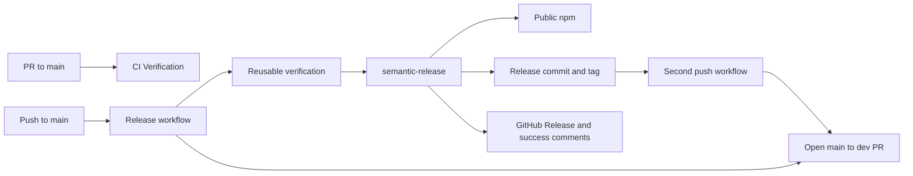
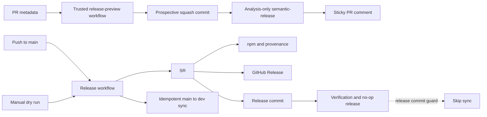

# Release Governance and Pull Request Preview Architecture and Implementation Plan

> Status: READY FOR REVIEW
>
> Plan version: 5.0
>
> Revision: 12
>
> Last updated: 2026-09-09
>
> Repository/workspace: `clalexander/flow-stack`
>
> Branch: `feat/release-governance`
>
> Baseline commit: `3a358899e1b98badd3ce7f9e06fc109bae5d2887`
>
> Working tree: Clean at planning baseline
>
> Canonical location: `docs/plans/release-governance-plan.md`
>
> Current phase: Phase 3 superseded after implementation reversion; Phases 4 and 5 blocked pending an approved replan
>
> Implementation authorization: Phases 1 and 2 accepted; Phase 3 superseded by user direction after code reversion; Phases 4 and 5 are not authorized
>
> Supersedes: None

> Phase 3 supersession: On 2026-09-09, the user directed that Phase 3 be deprecated and confirmed its implementation had already been reverted. Phase 3's preview workflow, scripts, tests, and temporary-repository support are not part of the current implementation. Its design and local validation record remain below as historical evidence only. Phase 4 and Phase 5 depend on Phase 3 and must not begin until an approved plan revision defines any remaining release-governance work.

## Purpose

This plan governs four related corrections to Flow Stack's release automation:

1. retain a documented inactive release-rule template for future pre-1.0 projects without changing this package's release behavior;
2. make the post-release `main`-to-`dev` pull request idempotent across the release commit's second workflow run;
3. publish a trustworthy semantic-release preview as a sticky comment on pull requests targeting `main`.

The already-published `v1.0.0` remains published and remains the npm `latest` version. This initiative does not attempt to reconstruct a `0.x` latest line or alter Flow Stack's current conventional semantic-release behavior. The repository retains an inactive release-rule template that maintainers may deliberately enable in a future pre-1.0 project.

> This is a planning document. It does not authorize implementation.

## Intent and Goals

### Intent

Preserve the current Conventional Commit release behavior while retaining an inactive, documented pre-1.0 release-rule template for future projects. Make release effects visible before merge and repair the observed back-merge failure without weakening verification or repository protections.

### Goals

1. The release configuration contains a commented, inactive template that classifies breaking changes as minor for future pre-1.0 projects.
2. Flow Stack retains semantic-release's existing Conventional Commit behavior.
3. The generated release commit cannot attempt a second back-merge.
4. An existing open `main`-to-`dev` pull request is always a successful synchronization no-op.
5. Every pull request targeting `main` receives one updated release-preview comment derived from the prospective squash commit.
6. Privileged preview automation never checks out or executes pull request code.
7. Release and CI documentation accurately describe the resulting behavior.

### Success Outcomes

- `release.config.mjs` contains an inactive `{ breaking: true, release: 'minor' }` template with usage context.
- Flow Stack's active release rules remain behaviorally unchanged.
- No workflow input, force-major plugin, or alternate release command is added.
- The workflow run caused by `chore(release): <version>` does not run `Open back-merge PR`.
- If any open same-repository PR has head `main` and base `dev`, synchronization exits zero and reports that PR.
- A real release retains semantic-release's default associated-PR and associated-issue success comments.
- A PR to `main` has exactly one bot-authored preview comment. Every `synchronize` event for a new PR head SHA recomputes and updates that same comment; title and body edits also update it.
- A preview is produced from trusted base-branch tooling and untrusted PR metadata only.

## Scope

### In Scope

- an inactive semantic-release pre-1.0 release-rule template;
- release-commit-triggered back-merge behavior;
- open back-merge PR detection;
- a release-preview workflow for PRs targeting `main`;
- preview tooling with focused tests;
- release and CI runbook updates;
- controlled local and GitHub-hosted validation.

### Out of Scope

- unpublishing `v1.0.0`;
- moving npm `latest` back to a `0.x` version;
- deleting or rewriting the `v1.0.0` tag or GitHub Release;
- creating a parallel `0.x` maintenance or npm distribution-tag channel;
- changing which non-breaking Conventional Commit types release;
- activating the pre-1.0 release-rule template in Flow Stack;
- changing semantic-release's default success-comment behavior;
- adding a `force-major-release`, `allow-major-release`, or equivalent workflow escape hatch;
- replacing semantic-release;
- changing the existing OIDC npm publication model, protected `npm` environment, or GitHub App credentials;
- suppressing GitHub account-level watch, release, mention, security, or Actions notifications;
- posting release previews to PRs that target `dev`, `release/**`, or `hotfix/**`;
- product source or public package API changes;
- unrelated workflow, dependency, or documentation cleanup.

### Deferred Possibilities

- A separately maintained `0.x` release line with a non-`latest` npm distribution tag.
- Release-preview checks on all CI pull requests. This may be revisited if cumulative previews on `dev` prove useful.
- Skipping the entire verification/release workflow for generated release commits. This plan skips only duplicate synchronization and preserves the documented second verification/no-op release run.

## Non-Negotiable Execution Protocol

1. Implementation proceeds through strictly sequential phases unless this plan explicitly identifies a safe parallel task.
2. Only one phase may be active at a time.
3. Starting Phase 1 requires explicit user authorization.
4. Completing a phase does not authorize the next phase.
5. After each phase, implementation stops and presents a closeout containing changed files, public API changes, tests, commands, evidence, deviations, and unresolved issues.
6. The next phase begins only after explicit user acceptance of the prior phase and authorization of the next.
7. Work outside the active phase allowlist is prohibited unless this plan is revised and the deviation is approved.
8. Unexpected unrelated defects are documented, not repaired.
9. The implementing agent must reread this entire document before planning the next implementation phase, before starting each phase, and after context compaction, session handoff, or resumed work.
10. This plan is updated at every phase boundary with authorization, backlog status, validation evidence, deviations, and acceptance.
11. Only tasks present in the authorized phase backlog may be executed. Newly discovered tasks must be added through a plan revision before execution.
12. An implementation, design, behavior, or intent change outside approved scope must not be executed or silently incorporated. Stop, document the proposal, ask the user for direction, and wait for explicit direction.
13. This plan remains the canonical initiative source of truth until explicitly superseded, promoted, archived, or removed.
14. Ambiguous approval language must not be treated as authorization to cross a phase boundary.
15. Branch changes and pull-request creation described in this plan are phase work and require the corresponding phase authorization.

Unambiguous authorization examples:

- `Authorize Phase 1.`
- `Phase 1 is accepted. Authorize Phase 2.`

## Document Maintenance Protocol

- Increment `Revision` on every saved planning update, checkpoint, phase closeout, authorization, and acceptance.
- Increment the minor plan version for additive detail that preserves approved architecture and phase structure.
- Increment the major plan version when approved scope, architecture, canonical semantics, or phase structure changes materially.
- Preserve stable requirement, decision, semantic case, pattern, acceptance, and task IDs.
- Mark removed requirements or tasks `SUPERSEDED`, `OUT OF SCOPE`, or `REMOVED` with a reason; never silently delete history.
- Update metadata, revision log, phase status, backlog status, validation evidence, deviations, and acceptance together at each phase boundary.
- Use only `DRAFT`, `BLOCKED`, `READY FOR REVIEW`, `APPROVED`, `IN PROGRESS`, `AWAITING ACCEPTANCE`, `COMPLETE`, and `SUPERSEDED` for document status.

## Planning Baseline

| Field                   | Value                                                                                       | Evidence                                 |
| ----------------------- | ------------------------------------------------------------------------------------------- | ---------------------------------------- |
| Repository root         | Local checkout of `clalexander/flow-stack`                                                  | Workspace inspection                     |
| Branch                  | `dev`                                                                                       | `git branch --show-current`              |
| Baseline commit         | `3a358899e1b98badd3ce7f9e06fc109bae5d2887`                                                  | `git rev-parse HEAD`                     |
| Working tree            | Clean                                                                                       | `git status --short` returned no entries |
| Current production tag  | `v1.0.0` at `c36029502d39e99ad7aaed267855438e7b20b038`                                      | `git show v1.0.0`                        |
| Previous production tag | `v0.2.3`                                                                                    | `git describe --tags --abbrev=0 v1.0.0^` |
| Release actor           | `personal-release-automation[bot]`                                                          | `v1.0.0` author and committer metadata   |
| Relevant components     | semantic-release, release workflow, CI workflows, GitHub App, npm publication, release docs | Repository inspection                    |
| Related completed plan  | `docs/plans/flow-stack-ci-modernization-plan.md`, version 5.2 revision 23                   | Documentation inspection                 |
| Toolchain               | Node `>=22.12.0`; CI Node 22/24; pnpm 12.3.1; semantic-release 25.0.9                       | `package.json`, `verify.yml`             |

The baseline includes the merged back-sync PR #48. The plan file itself becomes the only working-tree change produced during planning.

## Revision Log

| Revision | Plan Version | Date       | Status              | Summary                                                                                                                                                                                                           | Author/Source                                  |
| -------- | ------------ | ---------- | ------------------- | ----------------------------------------------------------------------------------------------------------------------------------------------------------------------------------------------------------------- | ---------------------------------------------- |
| 1        | 1.0          | 2026-09-03 | READY FOR REVIEW    | Initial release-governance, back-merge, notification, preview, branch, and phased implementation plan.                                                                                                            | Initiative Architect                           |
| 2        | 1.0          | 2026-09-03 | READY FOR REVIEW    | Corrected the explicit-major contract so a manual force-major plugin can promote the current line after breaking commits have already shipped as minors; aligned inputs, semantics, tests, and phase steps.       | Initiative Architect self-review               |
| 3        | 2.0          | 2026-09-03 | READY FOR REVIEW    | Replaced the general major gate and force-major mechanism with the requested pre-1.0-only rule: breaking changes map to minor at `0.x` and retain conventional major behavior at `1.x` and later.                 | User correction                                |
| 4        | 2.1          | 2026-09-03 | READY FOR REVIEW    | Required the sticky dry-run comment to recompute and update for every PR head synchronization event; completed stale force-major cleanup and aligned preview semantics.                                           | User clarification and plan consistency review |
| 5        | 2.1          | 2026-09-03 | IN PROGRESS         | User accepted the plan, moved its canonical location to `docs/plans/`, moved work to `feat/release-governance`, and explicitly authorized Phase 1. No implementation work is recorded by this revision.           | User authorization                             |
| 6        | 3.0          | 2026-09-03 | IN PROGRESS         | User approved the inactive commented pre-1.0 rule as Phase 1's outcome. Removed automatic version-conditional policy, helper, and analyzer-proof scope; retained the template and closed Phase 1.                 | User scope decision                            |
| 7        | 3.0          | 2026-09-03 | IN PROGRESS         | User explicitly accepted Phase 1 and authorized Phase 2. No Phase 2 implementation work is recorded by this revision.                                                                                             | User authorization                             |
| 8        | 3.0          | 2026-09-03 | AWAITING ACCEPTANCE | Completed Phase 2: disabled semantic-release success comments, skipped sync after generated release commits, and changed sync identity to an open same-repository `main` to `dev` PR independent of its head SHA. | Phase 2 implementation                         |
| 9        | 4.0          | 2026-09-03 | AWAITING ACCEPTANCE | User chose to retain semantic-release success comments despite their GitHub-controlled email effects. Reverted comment suppression and removed it from initiative scope; retained completed back-sync changes.    | User scope decision                            |
| 10       | 4.0          | 2026-09-03 | IN PROGRESS         | User accepted Phase 2's revised outcome and authorized Phase 3. No Phase 3 implementation work is recorded by this revision.                                                                                      | User authorization                             |
| 11       | 4.0          | 2026-09-03 | AWAITING ACCEPTANCE | Completed local Phase 3 preview tooling, trusted-base workflow, and focused tests. Hosted GitHub event and comment evidence remains deferred to Phase 5.                                                          | Phase 3 implementation                         |
| 12       | 5.0          | 2026-09-09 | READY FOR REVIEW    | User directed that Phase 3 be deprecated and confirmed its implementation was reverted. Marked Phase 3 and its backlog `SUPERSEDED`; blocked its dependent Phases 4 and 5 pending an approved replan.             | User scope decision                            |

## Branch and Integration Strategy

| Phase                  | Working Branch                    | Base                                   | Integration Target | Rule                                                                                                           |
| ---------------------- | --------------------------------- | -------------------------------------- | ------------------ | -------------------------------------------------------------------------------------------------------------- |
| 1                      | `feat/release-governance`         | `dev` at the phase-authorized baseline | Remains unmerged   | Created by the user before Phase 1 authorization.                                                              |
| 2                      | `feat/release-governance`         | Accepted Phase 1 state                 | Remains unmerged   | Continue on the same branch because release workflow and its tests share contracts.                            |
| 3                      | `feat/release-governance`         | Accepted Phase 2 state                 | Remains unmerged   | Continue on the same branch because preview reuses the canonical release configuration and analysis contracts. |
| 4                      | `feat/release-governance`         | BLOCKED pending approved replan        | None               | Do not begin. Its existing backlog assumes accepted Phase 3 preview tooling.                                   |
| 5                      | `release/release-governance`      | BLOCKED pending approved replan        | None               | Do not create a promotion branch or PR. Its existing backlog depends on Phases 3 and 4.                        |
| 5 hosted preview proof | `test/release-preview-validation` | SUPERSEDED with Phase 3                | Never merge        | The preview workflow was reverted and must not receive hosted validation.                                      |

Phases 1 through 4 intentionally use one branch and one eventual PR to `dev`. Splitting their tightly coupled contracts across multiple branches would either duplicate work or require stacking PRs that cannot be validated independently. Production promotion is deliberately separate so the exact accepted `dev` snapshot is reviewable before it reaches `main`.

The promotion PR title must be non-releasing, for example `ci: govern major releases and preview release impact`. Its body must not contain a `BREAKING CHANGE:` footer. Merging it to `main` activates the workflow changes but should make the release job a successful no-op.

## Phase Status

| Phase | Conceptual Boundary                                       | Branch                       | Status     | Backlog Progress                 | Authorization                                                                                    | Acceptance                                                                      | Revision |
| ----- | --------------------------------------------------------- | ---------------------------- | ---------- | -------------------------------- | ------------------------------------------------------------------------------------------------ | ------------------------------------------------------------------------------- | -------- |
| 1     | Inactive pre-1.0 release-rule template                    | `feat/release-governance`    | COMPLETE   | 1 / 1 complete; 3 removed        | Received 2026-09-03: “Plan accepted. Moved to feat/release-governance branch. Authorize phase 1” | Received 2026-09-03: “Treat the inactive commented rule as an approved outcome” | 6        |
| 2     | Release workflow and back-merge                           | `feat/release-governance`    | COMPLETE   | 3 / 3 active complete; 2 removed | Received 2026-09-03: “Phase 1 accepted. Authorize phase 2”                                       | Received 2026-09-03: “Phase 2 accepted. Authorize phase 3”                      | 10       |
| 3     | Secure PR release preview                                 | `feat/release-governance`    | SUPERSEDED | 5 / 5 superseded after reversion | Received 2026-09-03: “Phase 2 accepted. Authorize phase 3”                                       | Not applicable; implementation was reverted                                     | 12       |
| 4     | Documentation, local validation, and integration to `dev` | `feat/release-governance`    | BLOCKED    | 0 / 3 complete                   | Not received                                                                                     | Not received                                                                    | 12       |
| 5     | Promotion to `main` and hosted proof                      | `release/release-governance` | BLOCKED    | 0 / 5 active complete; 1 removed | Not received                                                                                     | Not received                                                                    | 12       |

## Requirement Sources

| Source ID | Source                                                         | Authority/Scope            | Relevant Material                                                                                                                                                                        |
| --------- | -------------------------------------------------------------- | -------------------------- | ---------------------------------------------------------------------------------------------------------------------------------------------------------------------------------------- |
| SRC-000   | Initiative execution protocol                                  | Initiative process         | Phase gates, backlog, branch, scope, revision, validation, and handoff control                                                                                                           |
| SRC-001   | User request and follow-up decisions                           | Initiative                 | Inactive pre-1.0 rule template, no force-major mechanism, back-merge diagnosis, retained default release comments, main-target PR previews, retained `v1.0.0`, durable branch-aware plan |
| SRC-002   | Repository development and architecture rules                  | Repository                 | Maintainability, reuse, explicit boundaries, no unrelated changes, full quality gates                                                                                                    |
| SRC-003   | Repository security and workflow rules                         | Workflows/scripts          | Least privilege, no secrets in logs, untrusted input validation, OIDC, secure CI/CD                                                                                                      |
| SRC-004   | Environment safety constraints                                 | Local environment          | Existing toolchain only; no installs or writes outside workspace; no destructive commands                                                                                                |
| SRC-005   | `release.config.mjs` and `release.yml`                         | Current implementation     | Commit rules, plugins, release/dry-run jobs, App token, back-sync logic                                                                                                                  |
| SRC-006   | `ci.yml`, `verify.yml`, and `pr-title.yml`                     | Current implementation     | PR events, authoritative verification, conventional squash-title contract                                                                                                                |
| SRC-007   | `docs/development/release.md` and `ci.md`                      | Documented intent          | Release path, no-op release commit, dry-run safety, back-sync and CI contracts                                                                                                           |
| SRC-008   | Git history from `v0.2.3` to `v1.0.0`                          | Observed behavior          | `feat!` and `build!` commits, generated release commit, bot identity                                                                                                                     |
| SRC-009   | Failed `Open back-merge PR` log supplied by user               | Observed failure           | PR #48 existed, but preflight missed it and `gh pr create` rejected duplicate head/base                                                                                                  |
| SRC-010   | Installed semantic-release version and dependency declarations | Runtime contract to verify | semantic-release 25.0.9 and bundled analyzer/GitHub plugins                                                                                                                              |

## Active Requirements

### Functional Requirements

| ID     | Requirement                                                                                                                                                                                | Source              | Verification                                       | Status     |
| ------ | ------------------------------------------------------------------------------------------------------------------------------------------------------------------------------------------ | ------------------- | -------------------------------------------------- | ---------- |
| FR-001 | When deliberately uncommented in a future pre-1.0 project, the retained release-rule template classifies breaking changes as minor releases. It is inactive in Flow Stack.                 | SRC-001             | Config review                                      | ACTIVE     |
| FR-002 | Flow Stack's active breaking-change classification remains unchanged by this initiative.                                                                                                   | SRC-001             | Config diff and import check                       | ACTIVE     |
| FR-003 | No manual major-release workflow input, force-major plugin, or alternate release path may be added by this initiative.                                                                     | SRC-001             | Config and workflow review                         | ACTIVE     |
| FR-004 | The generated `chore(release): <version>` push must not attempt another `main`-to-`dev` PR.                                                                                                | SRC-001, SRC-009    | Condition tests/review and hosted release evidence | ACTIVE     |
| FR-005 | Any open same-repository PR from `main` to `dev` must make synchronization a successful no-op regardless of its currently observed head SHA.                                               | SRC-001, SRC-009    | Script tests/review and hosted PR evidence         | ACTIVE     |
| FR-006 | SUPERSEDED: semantic-release must suppress its default success comments on associated PRs and issues. The user chose to retain the comments despite their GitHub-controlled email effects. | User scope decision | Plan revision 9                                    | SUPERSEDED |
| FR-007 | SUPERSEDED: Every PR targeting `main` receives a semantic-release preview comment.                                                                                                         | User scope decision | Phase 3 supersession, revision 12                  | SUPERSEDED |
| FR-008 | SUPERSEDED: Preview comments update in place after PR title, body, and head changes without accumulating duplicates.                                                                       | User scope decision | Phase 3 supersession, revision 12                  | SUPERSEDED |
| FR-009 | SUPERSEDED: A preview reports `no release` or predicted release type, version, notes, and analyzed base/head identifiers.                                                                  | User scope decision | Phase 3 supersession, revision 12                  | SUPERSEDED |

### Domain and Data Requirements

| ID     | Requirement                                                                                                                                                       | Source              | Verification                      | Status     |
| ------ | ----------------------------------------------------------------------------------------------------------------------------------------------------------------- | ------------------- | --------------------------------- | ---------- |
| DR-001 | The pre-1.0 template is a commented `{ breaking: true, release: 'minor' }` entry located beside the active release rules; it receives no committed-version input. | SRC-001, SRC-005    | Config review                     | ACTIVE     |
| DR-002 | The template remains inactive and does not change Flow Stack's active rules.                                                                                      | SRC-001, SRC-005    | Config import and diff review     | ACTIVE     |
| DR-003 | Existing custom classifications remain unchanged: `chore(deps)` patch; `chore(deps-dev)`, `ci`, `test`, and `chore(release)` no release.                          | SRC-005             | Policy regression tests           | ACTIVE     |
| DR-004 | A back-merge identity is repository + open state + head repository/ref `main` + base `dev`; head SHA is diagnostic, not identity.                                 | SRC-009             | Query tests/review                | ACTIVE     |
| DR-005 | SUPERSEDED: A PR preview models the repository's squash-merge contract as one prospective commit whose subject is the PR title and whose body is the PR body.     | User scope decision | Phase 3 supersession, revision 12 | SUPERSEDED |
| DR-006 | SUPERSEDED: The preview includes mainline commits since the last release plus the prospective squash commit, not individual PR commit subjects.                   | User scope decision | Phase 3 supersession, revision 12 | SUPERSEDED |
| DR-007 | SUPERSEDED: The sticky comment marker is stable and only bot-authored marker comments are considered.                                                             | User scope decision | Phase 3 supersession, revision 12 | SUPERSEDED |

### Architectural Requirements

| ID     | Requirement                                                                                                                                                                           | Source              | Verification                        | Status     |
| ------ | ------------------------------------------------------------------------------------------------------------------------------------------------------------------------------------- | ------------------- | ----------------------------------- | ---------- |
| AR-001 | semantic-release remains the sole release analyzer and publisher; no second Conventional Commit classifier may drift from it.                                                         | SRC-002, SRC-005    | Dependency/control-flow review      | ACTIVE     |
| AR-002 | SUPERSEDED: release rules are constructed by a pure reusable TypeScript policy helper from the committed package version. The approved inactive template replaces this helper design. | SRC-001             | Plan revision 6                     | SUPERSEDED |
| AR-003 | SUPERSEDED: Preview analysis uses semantic-release programmatically in dry-run, no-CI, analysis-only mode against a workspace-local temporary repository.                             | User scope decision | Phase 3 supersession, revision 12   | SUPERSEDED |
| AR-004 | SUPERSEDED: Preview workflow and tooling are separate from authoritative `Verification`; preview failure does not weaken branch protection.                                           | User scope decision | Phase 3 supersession, revision 12   | SUPERSEDED |
| AR-005 | The existing manual release dry run retains no npm environment, OIDC permission, App token, or mutating plugins.                                                                      | SRC-003, SRC-007    | Workflow review and hosted dispatch | ACTIVE     |
| AR-006 | SUPERSEDED: Preview tooling follows the existing `.github/scripts/*.ts` plus `test/tooling/*.test.ts` pattern and executes on Node 24.                                                | User scope decision | Phase 3 supersession, revision 12   | SUPERSEDED |
| AR-007 | SUPERSEDED: Local temporary repositories for preview analysis live only under ignored `.tmp/release-governance/` and are removed after validation.                                    | User scope decision | Phase 3 supersession, revision 12   | SUPERSEDED |

### Security and Operational Requirements

| ID     | Requirement                                                                                                                                                                                        | Source           | Verification                                           | Status |
| ------ | -------------------------------------------------------------------------------------------------------------------------------------------------------------------------------------------------- | ---------------- | ------------------------------------------------------ | ------ |
| SR-001 | The PR preview uses `pull_request_target` only with trusted base-branch workflow, config, scripts, and installed dependencies. It must never check out, import, build, or execute PR head content. | SRC-003          | Workflow source review and hosted logs                 | ACTIVE |
| SR-002 | PR title and body are untrusted data and must enter Git only through an environment/file/stdin-safe boundary, never shell interpolation or `eval`.                                                 | SRC-003          | Tests and workflow review                              | ACTIVE |
| SR-003 | Preview permissions are limited to `contents: read` and `pull-requests: write`; no App credentials, npm environment, OIDC, or repository contents write permission are available.                  | SRC-003          | Workflow permission review                             | ACTIVE |
| SR-004 | Preview output must not contain tokens, environment dumps, authorization headers, or raw internal stack traces.                                                                                    | SRC-003          | Failure tests and hosted log review                    | ACTIVE |
| SR-005 | Preview comments are bounded to GitHub's comment size with deterministic truncation that preserves marker, result summary, and provenance.                                                         | SRC-003          | Boundary tests                                         | ACTIVE |
| SR-006 | Back-merge and real release mutation continue using the existing short-lived least-privilege Release Automation App token.                                                                         | SRC-003, SRC-005 | Workflow review                                        | ACTIVE |
| OR-001 | Per-PR concurrency cancels superseded preview runs so stale analyses cannot overwrite newer comments. Every completed synchronize run must record the event head SHA in the updated comment.       | SRC-001          | Workflow concurrency and hosted sequential-commit test | ACTIVE |
| OR-002 | Preview analysis or comment mutation failure fails visibly; it must not post a false `no release` result.                                                                                          | SRC-001          | Failure tests and hosted check                         | ACTIVE |
| OR-003 | Existing GitHub watch/release/security/Actions notification preferences remain outside repository control and are not represented as suppressible by this change.                                  | SRC-001          | Documentation review                                   | ACTIVE |

### Testing and Validation Requirements

| ID     | Requirement                                                                                                                                           | Source  | Verification           | Status     |
| ------ | ----------------------------------------------------------------------------------------------------------------------------------------------------- | ------- | ---------------------- | ---------- |
| TR-001 | Focused tests cover existing active release rules, no-release behavior, preview formatting, marker identity, truncation, and malformed results.       | SRC-002 | Vitest results         | ACTIVE     |
| TR-002 | SUPERSEDED: workspace-local temporary Git repositories prove version-conditional analyzer behavior. The approved template requires no analyzer proof. | SRC-001 | Plan revision 6        | SUPERSEDED |
| TR-003 | Failed analysis and failed comment update must be tested as failures, not converted to no-release success.                                            | SRC-003 | Unit/integration tests | ACTIVE     |
| TR-004 | Each implementation phase runs focused validation; Phase 4 runs build, typecheck, tests, lint, format check, and diff check in repository gate order. | SRC-002 | Phase closeouts        | ACTIVE     |
| TR-005 | GitHub event, permission, App, PR API, and comment-update behavior receive controlled hosted validation before initiative completion.                 | SRC-003 | Phase 5 evidence       | ACTIVE     |

### Documentation and Process Requirements

| ID     | Requirement                                                                                                                                                                      | Source           | Verification                  | Status |
| ------ | -------------------------------------------------------------------------------------------------------------------------------------------------------------------------------- | ---------------- | ----------------------------- | ------ |
| PR-001 | Implementation is limited to the authorized phase backlog and approved scope. Out-of-scope design or behavior changes require a plan revision and explicit user direction.       | SRC-000          | Revision and closeout records | ACTIVE |
| PR-002 | This entire plan must be reread before planning or starting each phase and after compaction, handoff, or resumed work.                                                           | SRC-000          | Phase checkpoints             | ACTIVE |
| PR-003 | Phases 1-4 use `feat/release-governance` from `dev`; Phase 5 uses a fresh `release/release-governance` from accepted `dev`.                                                      | SRC-001          | Git branch/PR evidence        | ACTIVE |
| PR-004 | Release and CI runbooks must document the inactive pre-1.0 template, promotion procedure, default semantic-release comments, preview trust boundary, and back-merge idempotency. | SRC-001, SRC-007 | Documentation review          | ACTIVE |
| PR-005 | The plan is updated at every phase boundary and remains the canonical source of truth until completion or supersession.                                                          | SRC-000          | Revision log                  | ACTIVE |

## Acceptance Criteria

| ID     | Acceptance Criterion                                                                                                                                                                                                                                          | Requirements                   | Evidence                                |
| ------ | ------------------------------------------------------------------------------------------------------------------------------------------------------------------------------------------------------------------------------------------------------------- | ------------------------------ | --------------------------------------- |
| AC-001 | The inactive pre-1.0 rule template is present and Flow Stack's active breaking-change classification is unchanged.                                                                                                                                            | FR-001, FR-002, DR-001, DR-002 | Config import and diff review           |
| AC-002 | Existing custom release classifications remain unchanged.                                                                                                                                                                                                     | DR-003                         | Config diff review                      |
| AC-003 | `release.yml` has no major-release input or alternate major path; normal and manual dry runs use the same existing release configuration.                                                                                                                     | FR-003, AR-001                 | Workflow and config review              |
| AC-004 | The release-commit-triggered run skips synchronization, while a normal/manual release run may synchronize.                                                                                                                                                    | FR-004                         | Hosted run jobs and conditions          |
| AC-005 | Open PR #48's former state is represented by a test/query case that exits zero even when its head SHA differs from current `main`.                                                                                                                            | FR-005, DR-004                 | Script test or controlled API evidence  |
| AC-006 | SUPERSEDED: a release must suppress semantic-release success comments. Default success comments are retained by user decision.                                                                                                                                | FR-006                         | Plan revision 9                         |
| AC-007 | A PR to `main` gets one preview comment; pushing at least two sequential commits produces a recomputation for each resulting `synchronize` event, preserves the same comment ID, and records each latest head SHA. Title/body edits also update that comment. | FR-007, FR-008, OR-001         | Controlled hosted PR evidence           |
| AC-008 | Hosted logs prove preview checked out trusted base only, received no App/npm/OIDC capability, and treated PR metadata as data.                                                                                                                                | SR-001, SR-002, SR-003         | Workflow log and permission review      |
| AC-009 | The full repository quality gate passes and the working tree contains only approved changes.                                                                                                                                                                  | TR-004                         | Commands and `git status --short`       |
| AC-010 | Canonical docs and this plan match deployed behavior and contain final evidence.                                                                                                                                                                              | PR-004, PR-005                 | Documentation review and final revision |

## Assumptions and Constraints

### Assumptions

| ID      | Assumption                                                                                                                                                                | Basis                                   | Risk if False                               | Resolution                                                            |
| ------- | ------------------------------------------------------------------------------------------------------------------------------------------------------------------------- | --------------------------------------- | ------------------------------------------- | --------------------------------------------------------------------- |
| ASM-001 | Squash merge remains enabled, so PR title/body model the future commit.                                                                                                   | Existing docs and PR-title workflow     | Preview differs from merged history         | Stop and revise preview semantics before implementation.              |
| ASM-002 | semantic-release 25's programmatic API returns `false` for no release and a structured result containing `nextRelease` for a release.                                     | Declared dependency and established API | Preview helper cannot use planned contract  | Verify in Phase 3; revise plan if contract differs.                   |
| ASM-003 | SUPERSEDED: `@semantic-release/github` accepts `successComment: false`. The option is not used because default success comments are retained.                             | User scope decision                     | No runtime dependency                       | Recorded by plan revision 9.                                          |
| ASM-004 | SUPERSEDED: a custom breaking rule can be activated conditionally by committed major version. The approved template is inactive and requires no runtime precedence proof. | User scope decision                     | No Flow Stack runtime impact while inactive | Recorded by plan revision 6.                                          |
| ASM-005 | The workflow `GITHUB_TOKEN` can update PR comments for same-repository `pull_request_target` events under explicit permission.                                            | GitHub Actions permission model         | Preview cannot comment                      | Hosted proof in Phase 5; no App token fallback without plan revision. |

### Constraints

- `v1.0.0` and npm `latest` remain unchanged by user decision.
- No dependency install or update is authorized; use the current lockfile and installed toolchain.
- No local validation may write outside the active workspace.
- GitHub-hosted behavior cannot be fully proven locally.
- The preview workflow first becomes trusted base-branch code after promotion to `main`; it cannot comment on its own initial promotion PR.
- The existing `Verification` job name remains a branch-protection contract.

## Material Open Questions

None. Foundational scope and policy questions were resolved by the user:

- retain `v1.0.0` and npm `latest`;
- retain an inactive breaking-to-minor template for future pre-1.0 projects, with no force-major mechanism;
- preview only PRs targeting `main`;
- repair the observed duplicate PR failure using its supplied log.

Phase 3 implementation must verify ASM-002 and ASM-005. A failed assumption is a drift guard, not permission to invent a replacement architecture.

## Terminology

- **Pre-1.0 template**: inactive commented release rule that a future project may deliberately enable to classify breaking changes as minor.
- **Breaking commit**: a Conventional Commit with `!` or a `BREAKING CHANGE:` footer as recognized by semantic-release.
- **Prospective squash commit**: synthetic commit containing PR title as subject and PR body as body, parented to the PR base SHA.
- **Analysis-only mode**: semantic-release with only commit analyzer and release-notes generator loaded.
- **Sticky comment**: one marker-bearing PR comment that is updated rather than duplicated.
- **Back-merge identity**: one open same-repository pull request from `main` to `dev`, independent of observed head SHA.
- **Release commit run**: second `release.yml` push run caused by semantic-release's `chore(release): <version>` commit.

## Current-State Observations

1. `release.config.mjs` uses standard semantic-release breaking-change behavior and has no major-version gate.
2. `v1.0.0` followed `v0.2.3`; the release range includes `feat!: require Node 22.12 or newer` and `build!: remove cjs support`.
3. `v1.0.0` is the generated `chore(release): 1.0.0` commit authored and committed by `personal-release-automation[bot]`.
4. `release.yml` triggers on every push to `main`, including the generated release commit.
5. `sync-main-into-dev` currently runs after every successful `release` job when `github.ref` is `main`.
6. Synchronization currently recognizes only an open PR whose `headRefOid` exactly equals the current `main` SHA.
7. The observed second run reached `gh pr create`; GitHub rejected it because PR #48 already existed from `main` to `dev`.
8. `concurrency: release-${{ github.ref }}` serializes main runs but does not deduplicate their later synchronization attempts.
9. The manual dry-run job already uses analysis-only plugins, no npm environment, no OIDC, no App token, and a local bare remote.
10. `ci.yml` verifies PRs to `main`, `dev`, `release/**`, and `hotfix/**`; release previews do not yet exist.
11. `pr-title.yml` validates titles, matching the documented squash-title release model.
12. Repository code contains no custom email sender. The relevant repository-controlled notification is the GitHub plugin's success comment; account-level emails are external settings.

### Documentation or Contract Discrepancies

| ID       | Documentation Says                                                              | Code/Observed Behavior Says                                                     | Planned Resolution                                                                                         |
| -------- | ------------------------------------------------------------------------------- | ------------------------------------------------------------------------------- | ---------------------------------------------------------------------------------------------------------- |
| DISC-001 | Back-merge is a no-op when an equivalent PR exists for the current main commit. | Exact-SHA filtering missed an already-open same-head/base PR and create failed. | Define equivalence by GitHub's open head/base invariant and report SHA only diagnostically.                |
| DISC-002 | A breaking footer always produces a major release.                              | This remains Flow Stack's active behavior.                                      | Retain an inactive pre-1.0 rule template for future projects; do not alter this package's active behavior. |
| DISC-003 | The release commit intentionally triggers a second verification/no-op release.  | That second run also attempted synchronization.                                 | Preserve verification/no-op release; skip only synchronization for generated release commits.              |

## Current Architecture



Release and preview policy are currently implicit in semantic-release defaults. The release workflow owns both publication and synchronization. The exact-SHA PR check does not match GitHub's head/base uniqueness rule.

## Target Architecture



### Responsibilities and Dependency Direction

- `release.config.mjs` remains semantic-release's canonical plugin configuration and contains the inactive pre-1.0 template beside the active custom rules.
- `.github/scripts/release-preview.ts` owns prospective commit-message construction, semantic-release result narrowing, bounded Markdown rendering, and the CLI boundary needed by workflows.
- `release-preview.yml` owns trusted checkout, dependency setup, temporary Git repository construction, GitHub comment query/upsert, permissions, and concurrency.
- `release.yml` owns real/manual release capabilities and back-sync mutation.
- GitHub remains source of truth for PR state; semantic-release remains source of truth for release classification and notes.
- Preview is informational automation, not a replacement for `Verification` or protected environment approval.

## Settled Design Decisions

| ID      | Decision                                                                                                                                                   | Rationale                                                                                        | Alternatives Rejected                                                                       | Consequences                                                                                     | Revisit When                                                              |
| ------- | ---------------------------------------------------------------------------------------------------------------------------------------------------------- | ------------------------------------------------------------------------------------------------ | ------------------------------------------------------------------------------------------- | ------------------------------------------------------------------------------------------------ | ------------------------------------------------------------------------- |
| DEC-001 | Keep `v1.0.0` published and npm `latest`.                                                                                                                  | Explicit user decision; published version history should not be rewritten.                       | Unpublish/retag; parallel 0.x latest recovery.                                              | The inactive pre-1.0 template does not affect the current `1.x` release line.                    | A supported 0.x maintenance channel is requested.                         |
| DEC-002 | Retain a commented breaking-to-minor rule in `release.config.mjs`; do not enable automatic version-conditional policy in Flow Stack.                       | User approved the inactive template as Phase 1's outcome.                                        | Automatic version-conditional helper; permanent breaking-to-minor rule; general major gate. | Flow Stack retains conventional behavior; a future project must deliberately uncomment the rule. | Flow Stack itself needs pre-1.0 policy enforcement.                       |
| DEC-003 | Do not add a major-release workflow input or plugin.                                                                                                       | Explicit user correction; the requirement is config policy, not release authorization machinery. | Manual input, repository variable, force-major plugin.                                      | A future intentional `0.x` to `1.0.0` transition requires a reviewed config-policy change.       | The project requests an explicit automated promotion mechanism.           |
| DEC-004 | SUPERSEDED: disable semantic-release's success comment. The user chose to preserve release comments rather than eliminate GitHub-controlled email effects. | User scope decision.                                                                             | Account-level notification changes; disabling comments.                                     | The default GitHub plugin behavior remains.                                                      | Notification preferences or repository requirements change.               |
| DEC-005 | Back-sync identity is open same-repo `main` head + `dev` base.                                                                                             | Matches GitHub's actual PR uniqueness rule and moving branch semantics.                          | Exact SHA; catch-and-ignore all create failures.                                            | Existing PR is reused even if its head advanced.                                                 | Sync changes to immutable snapshot branches.                              |
| DEC-006 | Preserve second release workflow verification but skip its sync job.                                                                                       | Fixes duplicate mutation while retaining documented defense-in-depth.                            | Skip entire generated release run.                                                          | Some CI cost remains.                                                                            | Second verification is intentionally removed in a separate policy change. |
| DEC-007 | Use a dedicated `pull_request_target` preview workflow with trusted base code only.                                                                        | Same-repo and fork PR comments need write permission; PR code must remain untrusted.             | `pull_request` with App token; executing PR workflow; no comments for forks.                | Initial workflow cannot preview its own promotion PR.                                            | GitHub provides safe write tokens for fork `pull_request` workflows.      |
| DEC-008 | Preview the prospective squash commit, not individual PR commits.                                                                                          | Matches repository merge and release semantics.                                                  | Analyze head commits; infer from labels.                                                    | Preview changes when title/body changes even without source changes.                             | Merge strategy changes from squash.                                       |
| DEC-009 | Use a stable marker and update one bot-authored comment.                                                                                                   | Prevents notification/comment spam and stale duplicates.                                         | New comment per run; check summary only.                                                    | Workflow needs `pull-requests: write`.                                                           | GitHub supports a richer durable preview surface.                         |
| DEC-010 | Phases 1-4 share one feature branch; production promotion uses a fresh release branch.                                                                     | Shared contracts need one coherent review; production needs an accepted immutable snapshot.      | One branch directly to main; stacked branches per phase.                                    | Phase gates are plan/review gates, not separate PRs.                                             | User requests independent PRs for each phase.                             |

## Canonical Patterns and Contracts

### Pattern Inventory

| Pattern ID | Concern                  | Chosen Pattern                                  | Canonical Location                   | Consumers                   |
| ---------- | ------------------------ | ----------------------------------------------- | ------------------------------------ | --------------------------- |
| PAT-001    | Pre-1.0 release template | Commented breaking-to-minor rule                | `release.config.mjs`                 | Future project maintainers  |
| PAT-002    | Analysis result          | Discriminated `release` / `no-release` result   | `.github/scripts/release-preview.ts` | Preview CLI/workflow, tests |
| PAT-003    | PR preview               | Trusted-base prospective squash analysis        | `release-preview.yml`                | PRs to `main`               |
| PAT-004    | Sticky comment           | Stable marker + bot-authored find/update/create | Preview script/workflow              | GitHub PR API               |
| PAT-005    | Back-sync                | Head/base idempotency plus release-commit guard | `release.yml`                        | Release runs                |

### PAT-001: Pre-1.0 Release Template

`release.config.mjs` keeps the following entry commented directly above the active repository-specific rules:

```js
// For pre-1.0 projects, uncomment to classify breaking changes as minor releases.
// { breaking: true, release: 'minor' },
```

The template is documentation for future projects, not Flow Stack runtime policy. It must remain inactive and the active release-rule array must otherwise remain unchanged.

### PAT-002: Structured Preview Result

```ts
export interface NoReleasePreview {
  readonly type: 'no-release';
  readonly baseSha: string;
  readonly headSha: string;
}

export interface ReleasePreview {
  readonly type: 'release';
  readonly baseSha: string;
  readonly headSha: string;
  readonly releaseType: 'major' | 'minor' | 'patch';
  readonly version: string;
  readonly notes: string;
}

export type PreviewResult = NoReleasePreview | ReleasePreview;
```

The semantic-release adapter must narrow unknown runtime output before constructing these types. Missing version/type/notes is an analysis failure, not `no-release`.

### PAT-003: Prospective Squash Commit

The workflow must:

1. check out `github.event.pull_request.base.sha` using the trusted workflow from the base branch;
2. install dependencies from that trusted checkout with `pnpm install --frozen-lockfile`;
3. validate base and head identifiers as 40-character lowercase hex SHAs before use;
4. write PR title and body from environment variables to a commit-message file without shell evaluation;
5. create one local commit parented to base, using the trusted base tree and the message file;
6. create a workspace-local bare remote under `.tmp/release-governance/` whose `main` points to that commit;
7. run analysis-only semantic-release with `dryRun: true` and `ci: false`, using the trusted release configuration.

The PR head SHA is provenance only. The head tree and scripts must not be checked out or executed.

### PAT-004: Sticky Comment

Use a marker such as:

```md
<!-- flow-stack-release-preview -->
```

The rendered comment must contain:

- `Release preview` heading;
- predicted `no release` or `<type> -> v<version>`;
- generated notes when a release exists;
- base SHA and PR head SHA in a collapsed details block;
- marker retained after deterministic truncation.

Query comments with pagination, select only a comment containing the exact marker and authored by `github-actions[bot]`, update the newest matching comment, and create only when none exists. Multiple matching bot comments are an operational anomaly: update the newest and report older IDs in logs without deleting them.

### PAT-005: Back-Sync Guard

Job condition semantics:

```yaml
if: >-
  ${{ github.ref == 'refs/heads/main' &&
  (github.event_name != 'push' ||
  !startsWith(github.event.head_commit.message, 'chore(release): ')) }}
```

The open-PR query must match repository, open state, base `dev`, head repository equal to `github.repository`, and head ref `main`. It must not require `headRefOid == main_sha`.

## Canonical Semantics

### Release Classification Matrix

| Case ID | Current Version                                     | Trigger             | Commit                                                    | Expected Result                                                  | Mutation                         |
| ------- | --------------------------------------------------- | ------------------- | --------------------------------------------------------- | ---------------------------------------------------------------- | -------------------------------- |
| REL-001 | Any version                                         | Push/manual dry run | `fix: ...`                                                | patch                                                            | normal release / none in dry run |
| REL-002 | Any version                                         | Push/manual dry run | `feat: ...`                                               | minor                                                            | normal release / none in dry run |
| REL-003 | Future project after deliberately enabling template | Push/manual dry run | breaking commit                                           | minor                                                            | normal release / none in dry run |
| REL-004 | Flow Stack `1.0.0`                                  | Push/manual dry run | breaking commit                                           | current semantic-release behavior                                | normal release / none in dry run |
| REL-005 | Any version                                         | Push/manual dry run | breaking commit                                           | semantic-release default unless template is deliberately enabled | normal release / none in dry run |
| REL-006 | Any valid version                                   | Any                 | `chore(deps): ...`                                        | patch                                                            | normal release / none in dry run |
| REL-007 | Any valid version                                   | Any                 | `chore(deps-dev)`, `ci`, `test`, or `chore(release)` only | no release                                                       | none                             |
| REL-008 | Invalid committed version                           | Any                 | any                                                       | configuration failure before analysis                            | none                             |

### Back-Sync Matrix

| Case ID | Trigger/State                                            | Existing PR                    | Expected Result                                                                              | Mutation             | Error                    |
| ------- | -------------------------------------------------------- | ------------------------------ | -------------------------------------------------------------------------------------------- | -------------------- | ------------------------ |
| SYN-001 | Generated release commit push                            | any                            | sync job skipped                                                                             | none                 | none                     |
| SYN-002 | Normal/manual release; `main` not ahead                  | none                           | successful no-op                                                                             | none                 | none                     |
| SYN-003 | Normal/manual release; open same-repo `main` -> `dev` PR | same or different observed SHA | successful no-op with PR details                                                             | none                 | none                     |
| SYN-004 | Normal/manual release; ahead and no PR                   | none                           | create one PR                                                                                | PR create            | none                     |
| SYN-005 | GitHub API/token failure                                 | unknown                        | workflow failure                                                                             | no assumed mutation  | surfaced error           |
| SYN-006 | Create races with another actor                          | PR appears after query         | workflow failure unless an immediate narrow requery proves the exact head/base PR now exists | possible external PR | surfaced or proven no-op |

If implementation adds the narrow SYN-006 recovery, it may suppress only GitHub's duplicate-head/base condition after requery. It must not blanket-ignore `gh pr create` failures.

### Preview Matrix

| Case ID | PR State/Input                | Expected Comment                                                                                  | Workflow Result |
| ------- | ----------------------------- | ------------------------------------------------------------------------------------------------- | --------------- |
| PRV-001 | Patch title                   | predicted patch and version                                                                       | success         |
| PRV-002 | Feature title                 | predicted minor and version                                                                       | success         |
| PRV-003 | Breaking title/body           | predicted release under the active Flow Stack configuration                                       | success         |
| PRV-004 | Non-releasing title           | explicit no-release result                                                                        | success         |
| PRV-005 | Existing marker comment       | update same comment ID                                                                            | success         |
| PRV-006 | Edited title/body             | recompute and update                                                                              | success         |
| PRV-007 | New head commit               | recompute and update                                                                              | success         |
| PRV-008 | Analysis malformed/fails      | no misleading comment update                                                                      | failure         |
| PRV-009 | Comment API fails             | analysis may be logged without secrets                                                            | failure         |
| PRV-010 | Oversized notes               | bounded deterministic comment with summary/marker retained                                        | success         |
| PRV-011 | Breaking title/body           | predicted major                                                                                   | success         |
| PRV-012 | Two sequential pushed commits | same comment ID updated once per resulting `synchronize` event, ending with each event's head SHA | success         |

## Error and Failure Semantics

| Condition                       | Public Behavior                                    | Retryable            | Observability                                 |
| ------------------------------- | -------------------------------------------------- | -------------------- | --------------------------------------------- |
| Semantic-release analysis fails | Workflow fails; existing comment remains unchanged | yes after correction | Error summary without secrets/raw environment |
| No release proposed             | Successful explicit no-release comment             | no                   | Sticky comment and workflow summary           |
| Duplicate back-sync PR exists   | Successful no-op                                   | no                   | PR number, URL, head SHA                      |
| Back-sync API failure           | Workflow fails                                     | yes                  | `gh` error with token masked                  |
| Preview comment too large       | Deterministically truncate notes                   | no                   | Comment states truncation                     |
| Preview comment mutation fails  | Workflow fails                                     | yes                  | API status and PR number, no token            |

## Security, Privacy, and Trust Boundaries

- PR author-controlled title, body, head SHA, and source repository are untrusted.
- `pull_request_target` executes only workflow and scripts from trusted `main`.
- The workflow must not use `actions/checkout` with `head.sha`, merge ref, or PR repository/ref.
- The workflow must not run `pnpm install`, Node imports, build, tests, or semantic-release configuration from the PR branch.
- Metadata reaches shell through environment variables and commit-message files, never expression interpolation inside shell source.
- `GITHUB_TOKEN` is job-scoped and least privilege. The Release Automation App secret is unavailable.
- Semantic-release preview loads analysis-only plugins and points to a local bare repository, making publication and remote mutation mechanically unavailable.
- Generated Markdown is treated as text. Preserve code fences/escaping and cap size; do not embed raw HTML from PR content outside semantic-release's normal notes without sanitization.
- No notification recipient data, email addresses, or GitHub account preferences are stored or logged.

## Data, Persistence, and Migration

No product data or schema changes occur.

Repository-persistent changes are workflow/config/script/test/document files. GitHub-persistent changes are one sticky comment per PR and normal release/back-sync artifacts. No migration is required.

The `v1.0.0` package, tag, release, and npm distribution tag remain untouched. Rollback is a normal revert of workflow/config changes through protected branches; already-published releases are never unpublished as rollback.

## Concurrency, Atomicity, and Idempotency

- Existing `release-${{ github.ref }}` concurrency remains non-cancelling so release runs serialize.
- Release-commit sync is skipped before mutation.
- Open head/base PR state is checked before create; GitHub remains final atomic enforcer.
- Preview concurrency is `release-preview-${{ github.event.pull_request.number }}` with `cancel-in-progress: true`.
- Before updating a comment, the job should confirm the analyzed PR head SHA still equals the current event/current API head; stale runs must exit without overwriting newer results.
- Comment upsert uses comment ID when found, so reruns are idempotent.
- Publication remains semantic-release's responsibility for tag/version idempotency.

## Observability and Operations

- Release analysis may log whether pre-major policy is active and the validated current version; it must not log unrelated package metadata.
- Sync logs current main SHA, ahead count, and existing/created PR URL.
- Preview logs PR number, base/head SHA, result type/version, marker-comment ID, and create/update action.
- Preview writes the same concise summary to `$GITHUB_STEP_SUMMARY` as it posts to the PR.
- No new dashboard or alert is required for this single-package repository.
- Workflow failure remains visible through GitHub Checks; maintainers rerun after correcting configuration.
- Operational docs distinguish repository-controlled semantic-release comments from user-controlled GitHub email/watch settings.

## Testing Strategy

| Layer           | Responsibility                                                  | Location                                                     | Required Cases                                   |
| --------------- | --------------------------------------------------------------- | ------------------------------------------------------------ | ------------------------------------------------ |
| Unit            | Result narrowing, rendering, truncation                         | `test/tooling/release-preview.test.ts`                       | PRV pure cases                                   |
| Integration     | Real semantic-release adapter against a temporary Git history   | `test/tooling/release-preview.test.ts` or same focused suite | PRV-001 through PRV-012                          |
| Workflow source | Trigger, permissions, trusted checkout, environment, conditions | Focused test helper or explicit source assertions            | SYN-001, SR-001 through SR-003                   |
| Hosted          | GitHub event/API/token/comment/back-sync behavior               | Controlled workflows/PRs                                     | SYN-001 through SYN-005, PRV-001 through PRV-009 |
| Repository      | Existing package behavior                                       | Current Vitest suites and quality gates                      | all existing 263+ tests                          |

Tests that create repositories must use unique children of `.tmp/release-governance/`, register cleanup before mutation, and remove them in `finally`/test cleanup. Failed-operation tests verify that no release comment is replaced with a false no-release result and no existing back-sync PR is modified.

## Validation Protocol

Use the repository's actual gate order:

```powershell
corepack pnpm run build
corepack pnpm run typecheck
corepack pnpm test
corepack pnpm run lint
corepack pnpm run format:check
git diff --check
```

Focused checks:

```powershell
corepack pnpm exec vitest run test/tooling/release-preview.test.ts
```

If integration tests are in a third file, include it explicitly in focused validation.

Repair commands, used only when their corresponding check fails:

```powershell
corepack pnpm run lint:fix
corepack pnpm run format
```

After `lint:fix`, inspect changes and rerun `lint`; do not restart build, typecheck, and test solely because automatic lint cleanup ran. After `format`, inspect changes and rerun `format:check`; do not restart build, typecheck, test, or lint solely because formatting changed. Broader validation is required when a repair changes behavior, types, workflow configuration, or anything beyond mechanical lint/format output.

No dependency installation/update, service/container startup, global tool change, or out-of-workspace scratch directory is authorized. GitHub workflow syntax/event behavior requires hosted validation because no repository action-linter command is currently defined.

## Implementation Strategy

Five phases separate policy contracts, release workflow behavior, privileged PR preview, integration/documentation, and production promotion. Phases 1-4 remain reviewable as one coherent feature branch while retaining mandatory acceptance stops. Phase 5 changes branch because production promotion and hosted proof must use the exact accepted `dev` state and trusted `main` workflow context.

## Phase 1: Inactive Pre-1.0 Release-Rule Template

### Goal

Retain the approved inactive pre-1.0 rule template without changing Flow Stack's active release behavior.

### Status and Gate

- Status: COMPLETE
- Branch: `feat/release-governance`, created by the user from the authorized `dev` baseline
- Start requires: `Authorize Phase 1.`
- Exit requires: approved template and explicit user acceptance
- Mandatory stop: request authorization for Phase 2; do not change workflow behavior yet

### Requirements Addressed

FR-001, FR-002, DR-001, DR-002, DR-003, AR-001, PR-003

### Phase Task Backlog

| Task ID | Task                                     | Requirements                                           | Step    | Dependencies        | Deliverable                                       | Verification                           | Status   |
| ------- | ---------------------------------------- | ------------------------------------------------------ | ------- | ------------------- | ------------------------------------------------- | -------------------------------------- | -------- |
| P1-T001 | Retain inactive pre-1.0 rule template    | FR-001, FR-002, DR-001, DR-002, DR-003, AR-001, PR-003 | 1.1     | None                | Commented template beside unchanged active rules  | Config import, diff, and user approval | COMPLETE |
| P1-T002 | Implement release-policy helper          | DR-001, DR-002, DR-003, AR-002                         | Removed | User scope decision | None; helper design replaced by inactive template | Plan revision 6                        | REMOVED  |
| P1-T003 | Wire policy into semantic-release config | FR-001, FR-002, AR-001                                 | Removed | User scope decision | None; active config remains unchanged             | Plan revision 6                        | REMOVED  |
| P1-T004 | Prove analyzer semantics                 | TR-001, TR-002                                         | Removed | User scope decision | None; template requires no analyzer proof         | Plan revision 6                        | REMOVED  |

### Package or Component Allowlist

- semantic-release configuration;
- canonical plan updates.

### File Allowlist

- `release.config.mjs`
- `docs/plans/release-governance-plan.md`

### Explicit Denylist

- `.github/workflows/**`
- package dependencies and lockfile
- product `src/**`
- release/CI runbooks
- tags, npm, GitHub Releases, and remote branches other than the authorized feature branch

### Detailed Steps

#### 1.1 Retain PAT-001

Use the user-created `feat/release-governance` branch from the authorized `dev` baseline. Add the inactive PAT-001 template directly above the unchanged active rules in `release.config.mjs`. Do not add a helper, version input, scratch directory, tests, or runtime behavior change.

### Public API and Contract Impact

No package public API impact. The release configuration gains documentation-only template text.

### Migration and Rollback

No release occurs in this phase. Removing the comment restores the prior configuration exactly. Do not change version or changelog.

### Phase Validation

```powershell
node --input-type=module --eval "await import('./release.config.mjs'); console.log('release config import passed');"
git diff --check
```

### Phase Acceptance Criteria

- AC-001 and AC-002 pass by config import and diff review.
- Active rules are unchanged; only the inactive template is added.
- No workflow, package, source, version, changelog, helper, test, or scratch file changed.

### Phase Closeout

### Phase 1 Closeout

- Status: COMPLETE
- Authorization received: 2026-09-03, “Plan accepted. Moved to feat/release-governance branch. Authorize phase 1”
- Acceptance received: 2026-09-03, “Treat the inactive commented rule as an approved outcome”
- Branch and SHA: `feat/release-governance` / `fa1c15b132b29b7fd28898acaecb6d98cc76f762`
- Requirements addressed: FR-001, FR-002, DR-001, DR-002, DR-003, AR-001, PR-003
- Backlog results: P1-T001 complete; P1-T002 through P1-T004 removed by plan revision 6
- Changed files: `release.config.mjs`; `docs/plans/release-governance-plan.md`
- Public API changes: None
- Workflow/release changes: None; active release behavior is unchanged
- Validation: release config Node import PASS; `git diff --check` PASS
- Hosted evidence: None required
- Automated repairs: None
- Security evidence: No credentials, workflows, package dependencies, or runtime release paths changed
- Deviations: Automatic version-conditional helper and analyzer proof removed by approved plan revision 6
- Unresolved issues: None
- Next action: STOP. Await explicit Phase 2 authorization.

## Phase 2: Release Workflow and Back-Merge

### Goal

Make back-sync match GitHub's real invariant while retaining semantic-release's default success comments.

### Status and Gate

- Status: COMPLETE
- Branch: continue `feat/release-governance`
- Start requires: Phase 1 accepted and `Authorize Phase 2.`
- Exit requires: Phase 2 acceptance
- Mandatory stop: request authorization for Phase 3

### Requirements Addressed

FR-003 through FR-005, DR-004, AR-005, SR-006, TR-003, AC-003 through AC-005

### Phase Task Backlog

| Task ID | Task                                       | Requirements    | Step    | Dependencies        | Deliverable                               | Verification                   | Status   |
| ------- | ------------------------------------------ | --------------- | ------- | ------------------- | ----------------------------------------- | ------------------------------ | -------- |
| P2-T001 | Add manual major input and env propagation | FR-003          | Removed | User correction     | None; mechanism explicitly excluded       | Plan revision 3                | REMOVED  |
| P2-T002 | Disable semantic-release success comments  | FR-006, DEC-004 | Removed | User scope decision | None; default success comments retained   | Plan revision 9                | REMOVED  |
| P2-T003 | Guard release-commit synchronization       | FR-004, DEC-006 | 2.3     | Phase 1             | Job condition                             | Focused workflow-source review | COMPLETE |
| P2-T004 | Repair back-sync PR equivalence            | FR-005, DR-004  | 2.4     | P2-T003             | Head/base preflight                       | Focused workflow-source review | COMPLETE |
| P2-T005 | Confirm one canonical release policy path  | FR-003, AR-001  | 2.1     | Phase 1             | No workflow bypass; dry run shares config | Workflow/config review         | COMPLETE |

### File Allowlist

- `.github/workflows/release.yml`
- `release.config.mjs`
- a focused workflow-source test if established
- `docs/plans/release-governance-plan.md`

### Explicit Denylist

- new preview workflow/scripts
- package dependencies and lockfile
- product source/tests
- runbook docs
- remote publication or real major release

### Detailed Steps

#### 2.1 Confirm no alternate major path

Do not add a release input, environment flag, or plugin that bypasses the canonical active release configuration. Confirm the existing manual dry run uses the same `release.config.mjs` policy as push releases.

#### 2.3 Skip generated release sync

Apply PAT-005 to `sync-main-into-dev`. Preserve `needs: release` and normal/manual release behavior. Do not skip the second verify/release jobs.

#### 2.4 Match GitHub PR identity

Query all open PRs for base `dev` and head owner:`main`; validate repository/ref fields. Any valid match exits zero with number, URL, current PR head SHA, and current main SHA. Remove exact-SHA matching. Optionally handle the narrow post-query race only as defined by SYN-006.

### Public API and Contract Impact

No workflow input or package API change.

### Migration and Rollback

Default false makes deployment fail-closed. Revert restores standard majors/comments and old sync behavior. No publication occurs during local validation.

### Phase Validation

```powershell
corepack pnpm run typecheck
corepack pnpm run lint
corepack pnpm run format:check
git diff --check
```

### Phase Acceptance Criteria

- AC-003 passes by source/config review.
- `release.yml` contains no alternate major-release mechanism.
- SYN-001 through SYN-005 logic is reviewable and deterministic.
- PR #48 failure shape is covered: existing head/base with differing observed SHA exits zero.

### Phase Closeout

### Phase 2 Closeout

- Status: COMPLETE
- Authorization received: 2026-09-03, “Phase 1 accepted. Authorize phase 2”
- Acceptance received: 2026-09-03, “Phase 2 accepted. Authorize phase 3”
- Branch and SHA: `feat/release-governance` / `fa1c15b132b29b7fd28898acaecb6d98cc76f762`
- Requirements addressed: FR-003 through FR-005, DR-004, AR-005, SR-006, TR-003, AC-003 through AC-005
- Backlog results: P2-T003 through P2-T005 complete; P2-T001 remains removed by plan revision 3 and P2-T002 is removed by plan revision 9
- Changed files: `release.config.mjs`; `.github/workflows/release.yml`; `docs/plans/release-governance-plan.md`
- Public API changes: None
- Workflow/release changes: Skip back-sync on generated release commits; reuse an existing open same-repository `main` to `dev` PR independently of head SHA; retain default semantic-release success comments
- Validation: default GitHub plugin configuration assertion PASS; workflow-source contract assertion PASS; `git diff --check` PASS; editor diagnostics PASS
- Hosted evidence: Deferred to Phase 5; no release or remote mutation was performed
- Automated repairs: None
- Security evidence: Existing short-lived App token and least-privilege job permissions retained; no secrets, credentials, OIDC scope, or npm publication behavior changed
- Deviations: Comment-suppression scope was removed by approved plan revision 9. No focused workflow-source test infrastructure existed, so the authorized focused source review/assertion was used
- Unresolved issues: None
- Next action: Phase 2 accepted. Phase 3 was authorized and is recorded separately.

## Phase 3: Secure Pull Request Release Preview

### Goal

Add a trusted-base, sticky release-preview comment for all PRs targeting `main`.

### Status and Gate

- Status: SUPERSEDED
- Branch: continue `feat/release-governance`
- Superseded by: User direction on 2026-09-09 to deprecate Phase 3 after its implementation was reverted
- Start and exit gates: Not applicable
- Mandatory stop: Do not restore preview implementation or begin a dependent phase without an approved plan revision and explicit authorization

### Requirements Addressed

SUPERSEDED: FR-007 through FR-009, DR-005 through DR-007, AR-003, AR-004, AR-006, AR-007, SR-001 through SR-005, OR-001, OR-002, TR-001, TR-003. These requirements describe reverted preview behavior and are retained as history only.

### Phase Task Backlog

| Task ID | Task                                                | Requirements                   | Step | Dependencies            | Deliverable                                   | Verification           | Status     |
| ------- | --------------------------------------------------- | ------------------------------ | ---- | ----------------------- | --------------------------------------------- | ---------------------- | ---------- |
| P3-T001 | Implement structured analysis adapter               | AR-003, PAT-002                | 3.1  | Phase 2                 | Preview result helper/CLI                     | Unit/integration tests | SUPERSEDED |
| P3-T002 | Implement bounded sticky-comment rendering          | FR-009, DR-007, SR-005         | 3.2  | P3-T001                 | Markdown renderer/marker                      | Unit tests             | SUPERSEDED |
| P3-T003 | Add trusted-base preview workflow                   | FR-007, SR-001, SR-002, SR-003 | 3.3  | P3-T001                 | `release-preview.yml`                         | Source/security review | SUPERSEDED |
| P3-T004 | Implement idempotent comment upsert and stale guard | FR-008, OR-001, OR-002         | 3.4  | P3-T002, P3-T003        | Query/update/create flow                      | Tests and review       | SUPERSEDED |
| P3-T005 | Complete preview semantic/failure tests             | FR-008, OR-001, TR-001, TR-003 | 3.5  | P3-T001 through P3-T004 | Focused test suite including per-head updates | Focused Vitest         | SUPERSEDED |

P3-T001 and P3-T002 may be developed together. P3-T003 may begin only after P3-T001's CLI/output contract is fixed. No other parallel workstream is authorized.

### File Allowlist

- `.github/scripts/release-preview.ts`
- `.github/workflows/release-preview.yml`
- `test/tooling/release-preview.test.ts`
- `.gitignore` only for the Phase 3 temporary repository scratch entry
- `docs/plans/release-governance-plan.md`

### Explicit Denylist

- `release.yml` and production plugin changes except a plan-approved defect in accepted Phase 2
- `ci.yml`, `verify.yml`, `pr-title.yml`
- package dependencies/lockfile
- product source/tests
- remote PR creation during this local phase

### Detailed Steps

#### 3.1 Implement PAT-002

Use semantic-release programmatically with `dryRun: true`, `ci: false`, local repository URL, and `RELEASE_ANALYSIS_ONLY=true`. Narrow the result. Emit machine-readable JSON to a designated file or `$GITHUB_OUTPUT`, not by scraping human CLI logs. Do not print raw environment or stack traces to comment output.

#### 3.2 Render bounded Markdown

Implement pure rendering and deterministic truncation below GitHub's maximum comment size. Preserve marker, summary, warning, and provenance before notes. Test special Markdown, multiline notes, and boundary sizes.

#### 3.3 Create trusted workflow

Add `pull_request_target` for `opened`, `reopened`, `synchronize`, `edited`, and `ready_for_review`, with base branch `main`. Use explicit top-level read permissions and job permissions of `contents: read`, `pull-requests: write`. Checkout the base SHA only with credentials unpersisted. Install trusted base dependencies with frozen lockfile. Follow PAT-003.

#### 3.4 Upsert safely

Use GitHub API/`gh api` with metadata passed through environment. Paginate comments, match exact marker plus bot author, and update/create. Before mutation, verify current PR head SHA still equals analyzed head SHA. Fail on API errors.

#### 3.5 Test semantics and failures

Cover PRV-001 through PRV-012 where locally testable. Simulate sequential distinct event head SHAs and prove each accepted event produces a new body for the same comment ID while an older/superseded head cannot overwrite the latest result. Explicitly prove analysis failure does not produce or overwrite a no-release comment. Assert workflow source lacks App secrets, OIDC, write contents, and PR-head checkout patterns if a stable source-test pattern is added.

### Public API and Contract Impact

SUPERSEDED: The former internal preview result contract and non-required PR check/comment were reverted. No package API change remains.

### Migration and Rollback

The implementation has been reverted. No preview workflow, comment, or temporary-repository support remains to migrate or roll back.

### Phase Validation

```powershell
corepack pnpm exec vitest run test/tooling/release-preview.test.ts
corepack pnpm run typecheck
corepack pnpm run lint
corepack pnpm run format:check
git diff --check
```

### Phase Acceptance Criteria

SUPERSEDED: Preview acceptance is no longer applicable because the implementation was reverted.

### Phase Closeout

### Phase 3 Closeout

- Status: SUPERSEDED
- Authorization received: 2026-09-03, “Phase 2 accepted. Authorize phase 3”
- Supersession received: 2026-09-09, “Deprecate phase 3. I've already reverted the code”
- Branch and SHA: `feat/release-governance` / `9abef452bd25340e1fedbff6b13957f3b60b3234`
- Requirements addressed: FR-007 through FR-009, DR-005 through DR-007, AR-003, AR-004, AR-006, AR-007, SR-001 through SR-005, OR-001, OR-002, TR-001, TR-003
- Backlog results: P3-T001 through P3-T005 complete; no tasks were removed or added
- Changed files: `.github/scripts/release-preview.ts`; `.github/workflows/release-preview.yml`; `test/tooling/release-preview.test.ts`; `.gitignore`; `docs/plans/release-governance-plan.md`
- Public API changes: None; the typed preview result is internal tooling only.
- Workflow/release changes: Added a non-required `pull_request_target` preview check. It checks out only the trusted base SHA, installs only trusted-base dependencies, builds a prospective squash commit from PR metadata through a file, analyzes a local bare repository with semantic-release in analysis-only mode, and creates or updates one marker-bearing comment only after checking the live head SHA.
- Validation: `pnpm exec vitest run test/tooling/release-preview.test.ts` PASS (9 tests); `pnpm run typecheck` PASS; `pnpm run lint` PASS; `pnpm run format:check` PASS; `git diff --check` PASS; editor diagnostics PASS.
- Hosted evidence: Deferred to Phase 5. No workflow, PR, publication, or remote mutation was performed.
- Automated repairs: Corrected semantic-release API result narrowing and one unsupported Vitest matcher discovered by focused validation.
- Security evidence: Source test confirms `pull_request_target`, base-only checkout, unpersisted credentials, no App token, no OIDC, no `contents: write`, analysis-only mode, local repository URL, cancellation concurrency, and stale-head check.
- Deviations: No temporary Git repository integration test was added because the workflow creates its temporary bare repository only on the hosted trusted runner; programmatic semantic-release import and type contract were verified locally.
- Unresolved issues: Hosted GitHub permissions, bot identity, and per-event sticky-comment behavior require Phase 5 controlled evidence.
- Supersession outcome: The Phase 3 implementation was reverted before acceptance. Its validation and security evidence above are historical only and do not authorize restoration.
- Next action: STOP. Do not begin Phases 4 or 5 until an approved plan revision defines remaining work.

## Phase 4: Documentation, Full Local Validation, and Integration to Dev

### Goal

Align canonical documentation, run the full gate, review the complete change, and integrate the accepted feature branch into `dev`.

### Status and Gate

- Status: BLOCKED
- Branch: continue `feat/release-governance`
- Start requires: Approved plan revision that replaces the superseded Phase 3 dependency, then explicit Phase 4 authorization
- Exit requires: Defined by that approved revision
- Mandatory stop: Do not begin the existing backlog or promote to `main`

### Requirements Addressed

PR-004, PR-005, TR-004, AC-009, AC-010

### Phase Task Backlog

| Task ID | Task                                         | Requirements   | Step | Dependencies     | Deliverable                         | Verification                   | Status      |
| ------- | -------------------------------------------- | -------------- | ---- | ---------------- | ----------------------------------- | ------------------------------ | ----------- |
| P4-T001 | Update release runbook                       | PR-004         | 4.1  | Phases 1-3       | Accurate release policy/operations  | Docs review/format             | NOT STARTED |
| P4-T002 | Update CI/index/contributor docs as required | PR-004         | 4.2  | P4-T001          | Preview/trust/branch docs           | Link and docs review           | NOT STARTED |
| P4-T003 | Run full validation and integrate to dev     | TR-004, PR-003 | 4.3  | P4-T001, P4-T002 | Green gate and accepted PR to `dev` | Commands, PR checks, merge SHA | NOT STARTED |

### File Allowlist

- `docs/development/release.md`
- `docs/development/ci.md`
- `docs/development/README.md`
- `docs/README.md`
- `CONTRIBUTING.md` only where current release classification becomes inaccurate
- all files accepted in Phases 1-3 for defect repair
- `docs/plans/release-governance-plan.md`

### Explicit Denylist

- new functional scope
- package dependencies/lockfile
- product source/API
- `main`, tags, npm, or GitHub Releases

### Detailed Steps

#### 4.1 Update release operations

Document the inactive pre-1.0 template, retained `v1.0.0`, default semantic-release success comments and their GitHub-controlled notification effects, preserved GitHub Releases, release-commit sync skip, head/base no-op, and recovery. Do not state that Flow Stack enforces breaking-to-minor behavior.

#### 4.2 Update CI and contributor guidance

Add preview workflow topology, triggers, trusted-base security model, sticky behavior, first-deployment limitation, and hosted verification. Update any statement that still says all breaking commits automatically major.

#### 4.3 Validate and integrate

Run all focused and complete gates. Inspect diff and status. Open one PR from `feat/release-governance` to `dev`, obtain required checks/review, and merge only after user accepts Phase 4 implementation. Record merge SHA in plan.

### Public API and Contract Impact

Documentation-only additions in this phase. Prior internal release-policy and preview contracts become documented.

### Migration and Rollback

Revert PR on `dev` before promotion if needed. Nothing is active on `main` yet.

### Phase Validation

```powershell
corepack pnpm run build
corepack pnpm run typecheck
corepack pnpm test
corepack pnpm run lint
corepack pnpm run format:check
git diff --check
git status --short
```

### Phase Acceptance Criteria

- All local gates pass.
- PR to `dev` passes `Verification` and title validation.
- Docs match exact implementation and do not imply account-level email suppression.
- Accepted feature PR is merged to `dev` and feature branch may then be deleted.
- Plan records merge SHA and stops before production promotion.

### Phase Closeout

Stop and request explicit Phase 4 acceptance and Phase 5 authorization.

## Phase 5: Promotion to Main and Hosted Proof

### Goal

Promote the exact accepted `dev` snapshot to `main`, activate the automation, and collect hosted evidence without unintentionally publishing a release.

### Status and Gate

- Status: BLOCKED
- Branch: create `release/release-governance` from accepted `dev`
- Start requires: Approved plan revision and acceptance of a revised Phase 4 outcome, then explicit Phase 5 authorization
- Exit requires: Defined by that approved revision
- Mandatory stop: Do not create a promotion branch, promotion PR, or hosted preview-validation PR

### Requirements Addressed

TR-005, AC-003 through AC-010, PR-003, PR-005

### Phase Task Backlog

| Task ID | Task                                               | Requirements           | Step    | Dependencies                    | Deliverable                                                | Verification                             | Status      |
| ------- | -------------------------------------------------- | ---------------------- | ------- | ------------------------------- | ---------------------------------------------------------- | ---------------------------------------- | ----------- |
| P5-T001 | Create immutable promotion branch/PR               | PR-003, AC-009         | 5.1     | Phase 4 merge                   | `release/release-governance` PR to main                    | Diff/PR checks                           | NOT STARTED |
| P5-T002 | Activate non-releasing promotion                   | AC-003, AC-004         | 5.2     | P5-T001                         | Main merge with no package release                         | Release run evidence                     | NOT STARTED |
| P5-T003 | Validate sticky preview on disposable PR           | AC-007, AC-008         | 5.3     | P5-T002                         | Same comment updated for each sequential commit/head event | Comment ID, head SHAs, run IDs, and logs | NOT STARTED |
| P5-T004 | Validate default and major dry runs                | AC-001, AC-003         | Removed | User correction                 | None; no alternate major mode exists                       | Plan revision 3                          | REMOVED     |
| P5-T005 | Validate next real release behavior and close plan | AC-004, AC-005, AC-010 | 5.5     | P5-T002; next warranted release | Release/back-sync/comment evidence                         | Hosted logs/artifacts and plan closeout  | NOT STARTED |
| P5-T006 | Validate canonical manual dry run                  | AC-003                 | 5.4     | P5-T002                         | Safe dry-run evidence                                      | Workflow run and config evidence         | NOT STARTED |

P5-T003 may run after P5-T002. P5-T005 may wait for the next warranted real release; until then the plan remains `AWAITING ACCEPTANCE`, not `COMPLETE`.

### Component Allowlist

- Git branches and PRs named in this phase;
- manual `Release` workflow dry-run dispatches;
- disposable validation PR/comment;
- plan evidence updates;
- corrective edits only after a documented revision and authorization.

### File Allowlist

- `docs/plans/release-governance-plan.md` for evidence/status updates
- no implementation file changes unless hosted validation exposes an in-scope defect and the plan is revised first

### Explicit Denylist

- manual npm publication outside `release.yml`
- any temporary release-policy bypass not represented by a reviewed plan revision
- merging the disposable validation PR
- force pushes, tag changes, unpublish, npm dist-tag changes
- unrelated fixes discovered in hosted runs

### Detailed Steps

#### 5.1 Create promotion snapshot

Create `release/release-governance` from accepted `dev`. Open PR to `main` titled `ci: govern major releases and preview release impact`; ensure body has no breaking footer. Compare branch SHA to accepted dev SHA. Run required checks.

#### 5.2 Merge and inspect activation

After explicit approval, merge promotion. Confirm resulting main commit is non-releasing. Inspect release workflow: verification succeeds, semantic-release no-ops, and normal sync creates/reuses one `main`->`dev` PR. Merge that sync to `dev` according to normal process.

#### 5.3 Exercise sticky preview

From updated `main`, create `test/release-preview-validation` with one harmless temporary documentation diff. Open PR to `main` with a patch-classified title and record the comment ID and head SHA. Push two additional harmless commits separately, waiting for each `synchronize` run to complete; confirm each run recomputes the preview, updates the same comment ID, and records that event's head SHA. Then edit title/body to feature and breaking cases and confirm the same comment updates. Also test that a superseded run cannot overwrite the newest head result. A push containing multiple commits may emit one `synchronize` event for only the final head; the contract is one update per GitHub head-change event, not one update for inaccessible intermediate SHAs. Inspect logs for base checkout and permissions. Close without merge and delete branch.

#### 5.4 Confirm the single dry-run path

On `main`, run the existing safe dry run and confirm it loads the same release configuration used by push releases. It may correctly no-op because no release commit is pending. The inactive pre-1.0 template is not enabled or tested against production behavior.

#### 5.5 Validate next real release

At the next warranted release, inspect npm provenance, tag, GitHub Release, associated PR/issue comments, generated release commit's second run, and back-sync. Confirm default semantic-release success comments are retained and the sync job skipped on the release commit. Record evidence and close plan. If waiting for this event is unacceptable, user may explicitly revise acceptance to controlled non-production evidence; do not silently weaken it.

### Public API and Contract Impact

Automation becomes active. No package source API change. At the current `1.x` version, breaking commits retain normal major behavior and publication remains protected by the existing `npm` environment review.

### Migration and Rollback

Before merge, close promotion PR. After merge, revert through a protected PR to `main`, then sync revert to `dev`. Do not rewrite releases. A failed preview workflow may be reverted independently; a failed publication follows existing corrective patch/deprecation policy.

### Phase Validation

Hosted evidence plus local gates if any corrective revision changes files. Exact local commands remain the Validation Protocol block.

### Phase Acceptance Criteria

- Promotion was non-releasing.
- Preview create/update/security cases pass.
- The single manual dry-run path remains safe and uses the canonical policy.
- Next real release preserves npm/tag/GitHub Release, retains default success comments, and skips sync for its generated release commit.
- Release commit's second run skips sync.
- Existing back-sync PR is a successful no-op.
- Plan contains final evidence, accepted deviations, and no unresolved gate.

### Phase Closeout

Set status `AWAITING ACCEPTANCE`, present full closeout, and stop. Set `COMPLETE` only after explicit user acceptance.

## Cross-Phase Dependencies

| Dependency                             | Producer          | Consumer                    | Gate                                       |
| -------------------------------------- | ----------------- | --------------------------- | ------------------------------------------ |
| Release policy contract                | Phase 1           | Phases 2-3                  | Phase 1 accepted                           |
| Canonical active release configuration | Phase 1           | Phases 3-5                  | Phase 1 accepted                           |
| Analysis result/comment contract       | Phase 3           | Phase 4 docs, Phase 5 proof | Phase 3 accepted                           |
| Accepted implementation on dev         | Phase 4           | Phase 5 promotion           | Phase 4 accepted and merged                |
| Trusted workflow on main               | Phase 5 promotion | Hosted preview proof        | P5-T002 complete                           |
| Real release event                     | Phase 5           | Final acceptance            | P5-T005 evidence or approved plan revision |

## Cross-Phase Drift Guards

Stop and request a plan revision when:

1. a required edit falls outside the active allowlist;
2. user-authored changes overlap an in-scope file ambiguously;
3. semantic-release programmatic result differs from PAT-002;
4. analyzer custom-rule precedence does not produce REL-003/REL-005;
5. any workflow input, environment flag, or alternate analyzer bypasses the committed-version policy;
6. preview requires checking out or executing PR code;
7. preview requires App credentials, OIDC, contents write, or npm environment;
8. GitHub token cannot update comments under the planned trust model;
9. squash merge is disabled or PR title/body no longer represent release commit semantics;
10. back-sync requires an immutable snapshot instead of moving `main`;
11. validation requires dependency installation/update or out-of-workspace writes;
12. a required action is absent from the active phase backlog;
13. an unrelated defect appears necessary for completion;
14. implementation would alter `v1.0.0`, npm `latest`, package source/API, or branch protection;
15. the initial promotion commit would itself trigger an unintended package release;
16. any security, privacy, notification, or cost implication exceeds these assumptions.

## Explicit Scope Exclusions

1. Repairing semantic version history by deleting `v1.0.0`.
2. Controlling GitHub email delivery for default semantic-release comments; notification delivery remains a recipient-level GitHub setting.
3. Posting previews to integration PRs targeting `dev`.
4. Making preview a required branch-protection check.
5. Replacing release notes, changelog, npm, provenance, or GitHub Release plugins.
6. Fixing unrelated CI or package issues.

## Implementation Handoff Protocol

1. Read this document in full before planning the next phase.
2. Read it again before starting the authorized phase.
3. Confirm active phase, branch, allowlist, denylist, requirements, backlog, and validation commands.
4. Confirm exact authorization and execute only active backlog tasks.
5. Do not rely on chat summaries as a substitute for this document.
6. Add newly discovered work through a plan revision before execution; out-of-scope or design-changing work requires user consultation and explicit direction.
7. Update this plan at the phase boundary with task status and evidence.
8. Stop after closeout and request explicit acceptance/authorization.

### Handoff to Implementing Agent

- Canonical plan: `docs/plans/release-governance-plan.md`
- Authorized phase: None; Phase 3 is superseded and Phases 4 and 5 are blocked pending an approved replan
- Plan version/revision: 5.0/12
- Baseline commit: `3a358899e1b98badd3ce7f9e06fc109bae5d2887`
- Mandatory first action after any proposed authorization: reread the entire plan, confirm the Phase 3 supersession, and obtain an approved revision that defines the allowed remaining work.
- Active backlog: none
- Stop condition: await an approved replan and explicit authorization for its defined phase.
- Prohibited action: do not restore preview code, begin Phases 4 or 5, or create a new branch/PR under the superseded phase structure.

## Phase Closeout Template

```md
### Phase N Closeout

- Status: AWAITING ACCEPTANCE
- Authorization received: <date and exact quote/reference>
- Branch and SHA: <branch / sha>
- Started on: <date>
- Completed on: <date>
- Plan revision at start: <revision>
- Plan revision at closeout: <revision>
- Requirements addressed: <IDs>
- Backlog results:
  - Completed: <task IDs>
  - Removed by approved revision: <IDs or None>
  - Remaining: None / <IDs>
  - Tasks added during implementation: None / <IDs and revision>
- Changed files: <paths>
- Public API changes: None / <details>
- Workflow/release changes: <details>
- Validation: <command and PASS/FAIL>
- Hosted evidence: None required / <run and PR references>
- Automated repairs: None / <commands and inspected changes>
- Security evidence: <details>
- Deviations: None / <approved revision>
- Unresolved issues: None / <details>
- Next action: STOP. Await explicit phase acceptance and next-phase authorization.
```

## Final Definition of Done

The initiative is complete only when:

1. every phase is explicitly accepted;
2. all active requirements and acceptance criteria are satisfied;
3. pre-major and stable release semantic cases pass;
4. back-sync cases pass without duplicate failures;
5. preview cases pass locally and on GitHub;
6. full package quality gates pass;
7. docs reflect deployed behavior;
8. no App/npm/OIDC capability reaches preview;
9. a real release proves GitHub Release preservation, retained default success comments, and generated-release sync skip;
10. the plan contains final branch/PR/run evidence and no unresolved gate;
11. final document status is explicitly set to `COMPLETE` after user acceptance.

## Plan Readiness Checklist

- [x] User and environment requirements are consolidated with stable IDs.
- [x] Current-state claims have repository or supplied-run evidence.
- [x] Foundational architecture, naming, and branch strategy are settled.
- [x] Core types, patterns, usage, and trust boundaries are explicit.
- [x] Observable release, sync, preview, and error semantics are defined.
- [x] Security, permissions, concurrency, rollback, notifications, and operations are addressed.
- [x] Phases have conceptual boundaries, backlogs, allowlists, denylists, gates, branches, and stops.
- [x] Every planned implementation action maps to a stable phase task.
- [x] Actual repository validation commands are included.
- [x] Acceptance criteria are observable and mapped to requirements.
- [x] Drift guards and scope exclusions are explicit.
- [x] A less-capable implementing agent need not re-derive core architecture.
- [x] Full reread is required before planning or starting each next phase.
